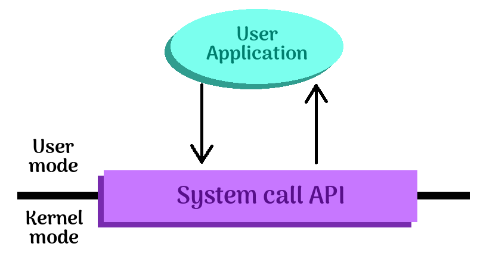
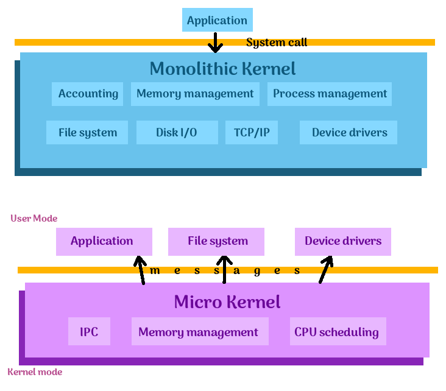
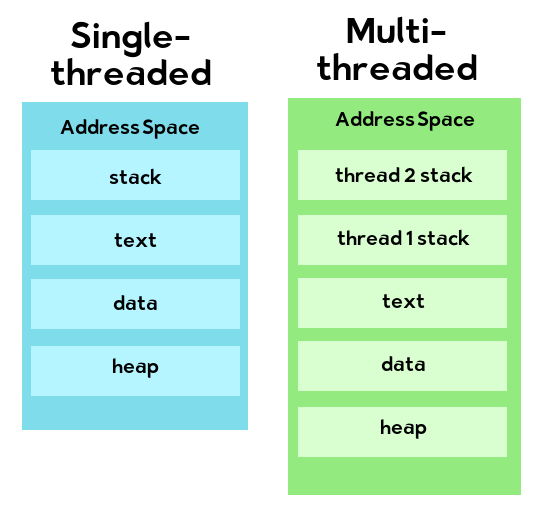
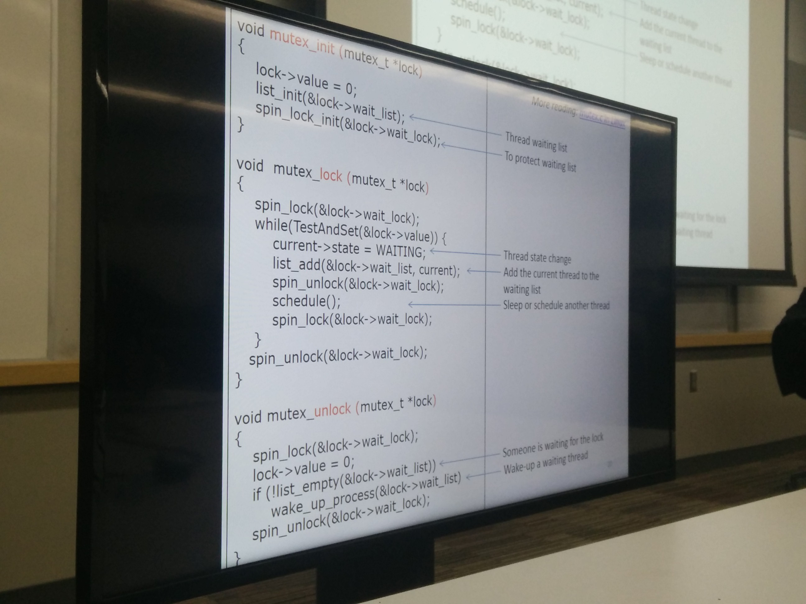
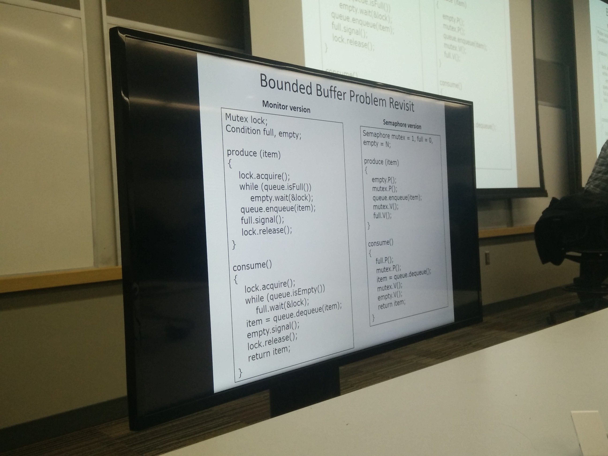
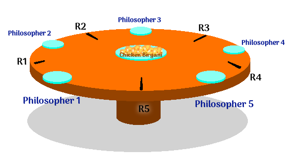
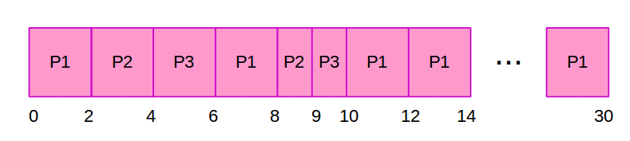

# Midterm Review

## Questions Format

* Fill in the blanks
* True/false
* Long-form
	* Write answer
	* Draw diagrams

Similar to quiz questions; "Very similar".

Small coding bits; fill in the blank.

Earliest deadline first - no question this time on exam? might be on final.

11 problems, several sub-problems per problem, 50 minutes.

---

## Note to self

Make sure to review the following:

* Application:
	* Figuring out the output of some code that uses fork()
	* Given two threads, possible output of a shared variable (without locks)
	* How to write `test_and_set` and `compare_and_swap` functions
		* test_and_set
			* will change the bool ptr passed in to true, whether it is true or false
			* returns the value of what the bool was originally - true or false
		* compare_and_swap
			* stores the current value of the ptr passed in
			* if the current value is the expected value, assign ptr's value to new value
			* return the original ptr value
	* Draw address space layout - single- and multi-threaded processes
		* per thread: stack(s), register(s)
		* shared: code, data, files
	* Draw process state diagram
		* new -> ready
		* ready -> running
		* running -> terminated
		* running -> ready
		* running -> waiting
		* waiting -> ready
	* How to write a mutex spinlock
	* Working with the Bounded Buffer problem
	* Drawing a Resource Allocation Graph
	* Solving Banker's Algorithm problems
	* Solving Dining Philosophers problems
	* Recognizing whether a state is safe or unsafe given some max/alloc table
	* How to draw a Gantt diagram

* Medium:
	* How PCB works
		* Contains pid
		* state data (registers)
		* control data
		* data used by OS to manage the process
	* How context switching works
		* save state - register values, program counter
		* restore state
		* cache is invalidated
	* How pipes work
	* How [**exec**](https://en.wikipedia.org/wiki/Exec_(system_call)) works
		* pass in path
		* pass in arg0 - program name
		* pass in arguments (list, vector, path vars, env var ptrs)
	* How to detect a deadlock
	* How to avoid a deadlock
	* Conditions for a deadlock
		* Mutual exclusion
		* No preemption
		* Hold and wait
		* Circular wait
	* 3 main types of scheduling
		* First Come First Served
		* Shorted Job First
		* Round Robin

* Small:
	* Chapter 1: Pros/cons of monolithic kernel
		* (+) Overhead is low (no IPC overhead.)
		* (+) Data sharing among modules is easy, since it is one program.
		* (-) Too big! Large program.
		* (-) Device drivers are "hard-coded" into the kernel, not flexible.
		* (-) If there is a bug in one part of the kernel, it can bring down the entire system.
	* Chapter 1: User-mode vs. Kernel-mode
		* Restrict operations like accessing registers, updating memory state.
		* Kernel has special privileges that any random app does not.
		* User-mode applications have to go through pre-defined system calls to access kernel mode.
	* Chapter 2: How system calls work
	* Shared memory vs. Message passing, pros/cons
		* Shared memory is faster but you gotta synchronize
		* Message passing is slower, copyin' yer data, but no sync (generale)
	* User threads vs. Kernel threads
	* Threads vs. Processes, pros/cons of multi-threading vs. multi-processing
	* Define race condition
		* a problem where 2+ threads attempt to access shared data at the same time.
		Whether the result is correct depends on the order of execution of the threads.
	* Define critical section
		* The portion of code where shared resources may be modified.
	* Mutex vs. Semaphore, pros/cons
	* Starvation vs. deadlock
		* Starvation is where a thread doesn't get to be processed,
		such as if it is constantly low priority and never gets dispatched.
		* Deadlocking occurs with currently running processes, where one thread
		is waiting on resources from a second thread, and vice versa, so
		they are stuck because both are waiting and neither will finish.
	* Review CFS (Completely Fair Scheduler)
		* Uses red-black tree, which auto-balances.
		* Weighted priority
	* Review fixed priority scheduling
		* Common to real-time systems
		* The processor always executes the highest priority task.
	* Review multi-level queue scheduling
		* Dividing processes by groups (foreground/background, for example)
		* Different group queues can have different scheduling schemes.
		* Low scheduling overhead
		* Inflexible - processes are stuck in one group.
		* Can make flexible with multilevel feedback queue scheduling
	* Review load balancing and multicore scheduling
		* Load balancing
			* SMP (Symmetric multiprocessing) systems
			* Balance the workload across all processors
			* Push migration
				* A task checks the load on each processor and moves
				jobs around if there is an imbalance.
			* Pull migration
				* An idle processor pulls waiting tasks from another processor.
	* Define waiting time
		* The amount of time a process spends in the ready queue waiting to be processed
	* Define scheduled latency
		* The time ti takes to schedule a task, going from the ready state to being scheduled for the first time.

---

## OS Structure

* OS Structure
	* User mode/kernel mode (dual-mode)
		* Memory protection, privileged instructions

	* System call
		* Definitions, dexamples, how it works?

	* Other concepts to know
		* Monolithic kernels vs. micro kernel (on midterm)



UNIX: Monolithic kernel

EVerything is implemented in kernel mode as a big chunk of the binary

Implements CPU scheduling, memory management, filesystems, and all other
OS modules in a single big chunk.

Pros and cons

* Overhead is low +
* Data sharing among modules is easy +
* Too big -
* Device drivers -
* A bug in one part of the kernel can crash the entire system -


*From https://en.wikipedia.org/wiki/Microkernel#/media/File:OS-structure.svg*



---

## Process

* Address space layout
	* Code, data, heap, stack
* Process states
	* new, ready, running, waiting, terminated
* Other concepts to know
	* PCB
	* Context switch

Process states - the state transition diagram (looks like ovaries).

Here's my version:


* running - instructions are being executed
* waiting - the process is waiting for some event to occur
* ready - the process is waiting to be assigned to a processor

running to ready state occurs when timer interrupt happens

Address space

* text - program code
* data - global data
* heap - dynamic memory
* stack - local variables, temporary data, grows at each function call


The above question will be on the exam (or something like it).
Know about fork, exec, etc.

### Review

Quiz: Describe the output

Hints: 	

* Each process has its own private address space,
* wait() blocks until the child finishes.
		
```c

int count = 0;

int main()
{
	int pid = fork();
	
	if ( pid == 0 )
	{
		count++;
		printf( "Child: %d \n", count );
	}
	else
	{
		wait( NULL );
		count++;
		printf( "Parent: %d \n", count );
	}
	
	count++;
	printf( "Main: %d \n", count );
	return 0;
}
```

Output:

	Child 1
	Main: 2
	Parent: 1
	Main: 2

---

## Inter-process communication

* Shared memory
	* Synchronization issue
* Message passing
	* Data copying - overhead

(Models of IPC diagram)

Pros and cons of each

IPC mechanism: POSIX shared memory

Pipes are message passing (?)

### Review

A process produces 100 MB of data in memory.
You want to share the data with two other processes
so that each can access half the data, 50 MB each.
What IPC mechanism do you use and why?

---

## Threads

User threads vs. kernel threads

* User-threading: kernel doesn't understand threads
	* If one thread has to wait on I/O (for ex), then all threads have to wait.

Key benefits over processes?

* + performance
* - protection

Multi-threads vs. Multi-process

Chrome is process-per-tab, Firefox is single-process, multi-threads.

* Multi-process
	* + protection
	* - performance ?
* Mult-threads
	* + performance
	* - protection

(Single and multithreaded process address layout diagram)



Multi-threaded: Every other section is shared but one, the thread stack.
Everything else is shared between threads.

Be able to draw this figure.

---

## Synchronization

Biggest part in the midterm; 30% ish.

* Race condition
* Synchronization instructions
	* test & set, compare & swap
* Spinlock
	* spin on wait
	* good for short critical sections
* Mutex

teacher goes through slides too fast.

missed a part here.

Given two threads:

```assembler
Thread 1
R1 = load( counter );
R1 = R1 + 1;
counter = store( R1 );

Thread 2
R2 = load( counter );
R2 = R2 - 1;
counter = store( R2 );
```

What are the possible outcomes, for *initial condition, counter = 5*.

4, 5, and 6 are possible outcomes.

Be able to implement test-and-set and complete a lock program.

### Review

Write the pseudo-code definition of *TestAndSet* instruction

```c
int TestAndSet( int * lock )
{
	int ret;
	// ?
	// ?
	return ret;
}
```

Complete the following lock implementation using *TestAndSet*

```c
void init_lock( int * mutex )
{
	*mutex = 0;
}

void lock( int * mutex )
{
	while ( /* ? */ ) { ; }
}

void unlock( int * mutex )
{
	// ?
}
```

Solution:

```c
int TestAndSet( int * lock )
{
	int ret;
	ret = *lock;
	*lock = 1;
	return ret;
}
```

```c
void init_lock( int * mutex )
{
	*mutex = 0;
}

void lock( int * mutex )
{
	while ( TestAndSet( mutex ) ) { ; }
}

void unlock( int * mutex )
{
	*mutex = 0;
}
```

Completely understand test and set implementation to write about.


Mutex



Bounded buffer problem



Review these two examples of the problem - closely.

Might need to fill-in-the-blank.

---

## Deadlock

* Deadlock conditions
* Resource allocation graph
* Banker's algorithm
* Dining philosopher example
* Other conecpts to know
	* Starvation vs. deadlock

How to detect deadlock, avoid deadlock, & banker's algorithm.

Conditions for deadlock

* Mutual exclusion
* No preemption
* Hold and wait
* Circular wait

All four conditions must simultaneously hold

### Review

Determine whether this state is safe or unsafe.

* Total resources: 12

<table>
	<tr>
		<th>Process</th>
		<th>Max</th>
		<th>Alloc</th>
	</tr>
	<tr>
		<td>P0</td>
		<td>10</td>
		<td>4</td>
	</tr>
	<tr>
		<td>P1</td>
		<td>3</td>
		<td>1</td>
	</tr>
	<tr>
		<td>P2</td>
		<td>6</td>
		<td>4</td>
	</tr>
</table>

* P0:
	* We are going to allocate **4** resources to P0. 
	* This leaves us with 8 total resources.
	* If we look at how many more resources *could* be requested by P0,
	that is 10 - 4, which is 6.
	* Since 6 <= 8, this is OK.
* P1:
	* We are going to allocate **1** resource to P1.
	* This leaves us with 7 total resources.
	* P1 could request 3 total resources, 3 - 1 = 2, so it might request
	an additional 2 resources.
	* 2 <= 7, so this is OK.
* P2:
	* We are going to allocate **4** resources to P2.
	* This leaves us with 3 total resources.
	* P2 might allocate 2 more resources (6-4).
	* 2 <= 3, so this is OK.

Available resources left over: 3.

**SAFE**

### Review

Can a request by P0 be granted?

* Total resources: 12
* Available resources: 0

<table>
	<tr>
		<th>Process</th>
		<th>Max</th>
		<th>Alloc</th>
	</tr>
	<tr>
		<td>P0</td>
		<td>10</td>
		<td>7</td>
	</tr>
	<tr>
		<td>P1</td>
		<td>3</td>
		<td>1</td>
	</tr>
	<tr>
		<td>P2</td>
		<td>6</td>
		<td>4</td>
	</tr>
</table>

**UNSAFE**


More complicated example will have more resources, can be a vector.

3-1 > 0
6-4 > 0

### Review

Dining philosophers problem



* Philosopher 1
	* Max[1] = [ 1, 0, 0, 0, 1 ]
	* Alloc[1] = [ 1, 0, 0, 0, 0 ]
* Philosopher 2
	* Max[2] = [ 1, 1, 0, 0, 0 ]
	* Alloc[2] = [ 0, 1, 0, 0, 0 ]
* Philosopher 3
	* Max[3] = [ 0, 1, 1, 0, 0 ]
	* Alloc[3] = [ 0, 0, 1, 0, 0 ]
* Philosopher 4
	* Max[4] = [ 0, 0, 1, 1, 0 ]
	* Alloc[4] = [ 0, 0, 0, 1, 0 ]
* Philosopher 5
	* Max[5] = [ 0, 0, 0, 1, 1 ]
	* Alloc[5] = [ 0, 0, 0, 0, 0 ]

Philosopher 5 has requested resource R5.

Is this safe or unsafe?

2. Find an index i such that

	Finish[i] == false AND Max[i] - Alloc[i] <= avail

If no such i exists, go to step 4.

---

## Scheduling

* Three main schedulers
	* FCFS
	* SJF/SRTF
	* RR
	* Gantt chart examples
	
* Other concepts to know
	* Fair scheduling CFS
	* Fixed priority scheduling
	* Multi-level queue scheduling
	* Load balancing and multicore scheduling
	

be able to draw diagram for main 3 scheduling types

Define **waiting time** - time spent in the ready queue.

Define **scheduled latency** - between ready to the first scheduled time


### Review

* Quantum size = 2

<table>
	<tr>
		<th>Process</th>
		<th>Burst times</th>
	</tr>
	<tr>
		<td>P1</td><td>24</td>
	</tr><tr>
		<td>P2</td><td>3</td>
	</tr><tr>
		<td>P3</td><td>3</td>
	</tr>
</table>

(arrival time must be given)

Gantt chart:



Waiting time: P1: 6, P2: 6, P3: 7, average waiting time: (6+6+7)/3 = 6.33.


