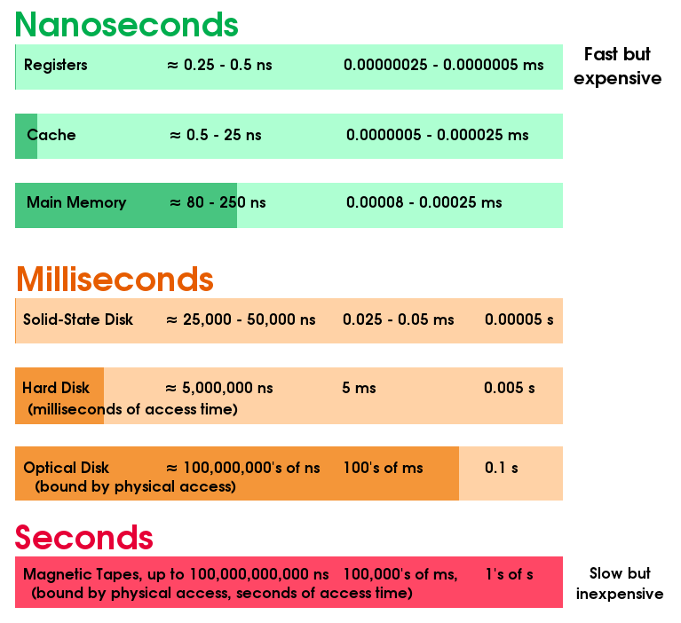

# Chapter 1: Introduction

Rachel's summary notes

* [Official book slides - Chapter 1](http://codex.cs.yale.edu/avi/os-book/OS9/slide-dir/PPT-dir/ch1.ppt)

## Vocabulary

* [Operating System](https://en.wikipedia.org/wiki/Operating_system)
* [Hardware](https://en.wikipedia.org/wiki/Computer_hardware)
* [CPU](https://en.wikipedia.org/wiki/Central_processing_unit)
* [Memory](https://en.wikipedia.org/wiki/Computer_memory)
* [Input/output devices](https://en.wikipedia.org/wiki/Input/output)
* [Application programs](https://en.wikipedia.org/wiki/Application_software)
* Control program - such as the OS, a program which manages program execution, prevents errors and improper use.
* [Moore's law](https://en.wikipedia.org/wiki/Moore%27s_law)
* [Kernel](https://en.wikipedia.org/wiki/Kernel_(operating_system))
* System programs
* [Middleware](https://en.wikipedia.org/wiki/Middleware)
* [Bootstrap program](https://en.wikipedia.org/wiki/Booting)
* [ROM](https://en.wikipedia.org/wiki/Read-only_memory)
* EEPROM
* [Firmware](https://en.wikipedia.org/wiki/Firmware)
* [System processes/daemons](https://en.wikipedia.org/wiki/Daemon_(computing))
* [Software/hardware interrupt](https://en.wikipedia.org/wiki/Interrupt)
* [System call/monitor call](https://en.wikipedia.org/wiki/System_call)
* Interrupt vector
* [RAM](https://en.wikipedia.org/wiki/Random-access_memory)
* DRAM
* [von Neumann architecture](https://en.wikipedia.org/wiki/Von_Neumann_architecture)
* [Instruction register](https://en.wikipedia.org/wiki/Instruction_register)
* [Direct memory access (DMA)](https://en.wikipedia.org/wiki/Direct_memory_access)
* Fault tolerant
* [Asymmetric multiprocessing](https://en.wikipedia.org/wiki/Asymmetric_multiprocessing), [symmetric multiprocessing](https://en.wikipedia.org/wiki/Symmetric_multiprocessing)
* Asymmetric, symmetric clustering
* [Parallelization](https://en.wikipedia.org/wiki/Parallel_computing)
* Distributed lock manager (DLM)
* Storage-area networks (SANs)
* [Memory Management Unit MMU](https://en.wikipedia.org/wiki/Memory_management_unit)

---

# Notes

## Operating System

		Definition of system
		1. a regularly interacting or interdependent group of items forming a unified whole 

		From Merriam-Webster, https://www.merriam-webster.com/dictionary/system

The Operating System is a system of software that manages various aspects of computer operation.

These areas generally are:

* [Process management](https://en.wikipedia.org/wiki/Process_management_(computing))
* [Memory management](https://en.wikipedia.org/wiki/Memory_management)
* [Interrupts](https://en.wikipedia.org/wiki/Interrupt)
* [File system](https://en.wikipedia.org/wiki/File_system)
* [Device drivers](https://en.wikipedia.org/wiki/Device_driver)
* [Networking](https://en.wikipedia.org/wiki/Computer_network)
* [Security](https://en.wikipedia.org/wiki/Computer_security)
* [I/O](https://en.wikipedia.org/wiki/Input/output)

The Operating System is responsible for allocating resources between software
in a manner such that everything gets processing time, memory to work with
to get its task done, and access to Input/Output devices.

The Operating System is also the foundation for the software that runs
on top of it, providing some user interface for the software programs
that allow the user to access the program's output, and provide the
program with input.

The Operating System also needs to provide some level of security, 
such as making sure the system is not used inappropriately, and also
to prevent, detect, and handle errors.

The Operating System is responsible for managing hardware, be a foundation for
the software programs that will run on top of it, and provide a means for
users to interact with that hardware via the software on top of the Operating System.

On the hardware layer, the Operating System needs to work with the CPU,
memory (RAM), and the I/O devices. 

## User view vs. System view

The *user* of the computer and the *system* can be viewed as having
different goals when it comes to interacting with the Operating System.

For a *user*, they need a way to interact with the computer via the
I/O devices - Mouse and keyboard are input devices, monitor and printer
are output devices.

The user cares about the usability of the system, generally preferring
something easy to use thanks to a Graphical User Interface.

Users want the system to be responsive, but don't care about the details
of how the Operating System allocates resources to the various programs.

The *system*, on the other hand, does care about how the Operating System
allocates resources. The system needs to have access to the various
resources, such as *CPU time*, *memory*, *file storage space*, 
*I/O device access*, and so on.

The *system* sees the Operating System as a resource manager. Everybody
should receive a fair share of the resources available.

## Perks of an Operating System

The Operating System as a layer between the user and the hardware has some
pros, such as:

* **Programmability** - We can write programs to interact with the hardware
via an API, rather than having to deal with the hardware directly.
* **Portability** - Software runs in the operating system, and is not hardware-
specific; we don't have to have multiple versions of a program custom
written for each type of processor, for example.
* **Safety** - Since the programs run on top of the Operating System, an error
will not (or should not) take down the entire system; one program is
essentially protected from the other programs.
* **Efficiency** - It is more efficient to have an OS managing resources than
having our programs each handle these things on their own. We can rely
on the OS to manage resources for us.

## Challenges of designing an Operating System

Building an OS is not as easy as just writing a single program. An OS
is made up of many aspects and many programs that are interconnected.

When designing an Operating System, we have to take into account...

* **Structure** - How do we organize all of the components of the Operating System?
* **Communication** - How do different programs communicate with one-another?
* **Performance** - How do we allocate resources fairly, but also efficiently?
* **Naming** - How are the resources addressed?
* **Protection** - How do we make sure programs can't do too much damage to the system? How do we protect programs from other programs?
* **Security** - How do we make sure that certain users can only perform certain tasks?
* **Reliability** - How do we make sure the system is reliable and not unstable?

## Operating System evolution

* Batch systems
* Multiprogramming
* Timesharing
* Parallel computing
* Distributed computing
* Virtualization

**Multiprogramming** is a technique that was used by old computers to
increase efficiency of the batch systems. Several programs would be loaded
into a computer at once, and while one program had to wait for a 
peripheral, that program was essentially put on hold (the context/state
saved), and the next program loaded in began processing.

With **Timesharing**, one CPU deals with multiple tasks at the same time.
The tasks are only "virtually" running at the same time, but they're
actually given time slices to work with; perhaps 10 ms per process.

How does the OS know when a certain amount of time has passed?
The OS has access to *timers*. It can use a timer to generate an
*interrupt* at a regular interval, which switches processing to
a different program.

Timesharing is also known as **Multitasking**.

As per Wikipedia:

		In multiprogramming systems, the running task keeps running until 
		it performs an operation that requires waiting for an external event 
		(e.g. reading from a tape) or until the computer's scheduler forcibly 
		swaps the running task out of the CPU. Multiprogramming systems are 
		designed to maximize CPU usage.
		
		In time-sharing systems, the running task is required to relinquish the CPU, 
		either voluntarily or by an external event such as a hardware interrupt. 
		Time sharing systems are designed to allow several programs to execute 
		apparently simultaneously.
		
		In real-time systems, some waiting tasks are guaranteed to be given the 
		CPU when an external event occurs. Real time systems are designed to 
		control mechanical devices such as industrial robots, which require 
		timely processing.

		(https://en.wikipedia.org/wiki/Computer_multitasking#Multiprogramming)

## Processor types

With a **single-core CPU**, the design challenge is **time sharing**:
when do we schedule a task, and which task?

With a **parallel processing CPU**, then we have to be concerned with
which **core** receives which tasks? How do we deal with performance?

With a **multiprocessor system**, we have multiple CPUs. Which tasks go
to which processors, and memory cost with accessing local vs. remote.
**Non-uniform memory access (NUMA) architecture**.

## Memory hierarchy

Main memory is fast, volatile, and expensive. The CPU has direct access to it,
so this also adds to its efficiency.

Disks like hard disks, optical disks, etc. are slower; non-volatile and inexpensive.
The CPU does not have direct access, so access overhead is also added on.

For each, performance varies on several levels... **Distance** - Distance from the CPU,
**Capacity/size** - KBs? MBs? GBs? TBs? **Bandwidth** - How much can be passed at once?

Each type of memory is also implemented with different types of technology.

## Means of protection

The OS has several means by which it enables processes to work together
and also to protect various parts of the system (processes, resources, the OS itself, etc.)

### Interrupts

**Interrupts** are used to let the processor know that it needs something.

A **Hardware Interrupt** is an interrupt from a hardware device, such as
a timer, the keyboard, disk drives, etc.

A **Software Interrupt** is an **exception** that is raised. Exceptions are
used as a means of error detection in a program, so that the error can be
investigated and handled appropriately. This could be dealing with division by zero,
or a math operation that results in a number too small to store in a traditional
variable.

When dealing with interrupts, the CPU's **state is saved** (what values are currently
in its registers), it handles the interrupt, restores its previous state,
and returns to its regularly scheduled program.

### Dual mode (user/kernel modes)

Dual mode is used to protect certain types of operations, so that an
average user cannot perform these operations.

Restricted operations can be things like *accessing registers*,
*updating memory states*, and so on.

This mode also helps distinguish between commands that are used by an
application vs the kernel itself. The kernel has special privileges that
any random application does not.

However, applications can enter into *kernel mode*, but only through
pre-defined **system calls**. The application requests an operation
to be done, which is handled by OS services.

### Memory

Memory also must be protected - one application shouldn't be allowed
to access or modify the memory in use by another application.
An application also should not be able to access memory in use
by the kernel.

## Memory space limitations - Virtual memory

The applications running in the OS must also share a limited memory space.
Virtual Memory utilizes a Memory Management Unit (**MMU**) which provides an
interface to the applications. Virtual addresses are provided to the
programs, and converts that to the physical address of the actual memory.

## Synchronizing tasks

Due to information being shared between processes and threads, we also
need to design a solution to make sure our data maintains its integrity.
Part of this is synchronizing our threads so that they're not both
accessing data at the same time, causing them both to overwrite
data, leading to an unexpected result.

We can handle thread synchronization via using atomic operations,
or lock methods, or even (for single-core systems), disabling interrupts while a thread is
working with data that shouldn't be changed at the same time.

