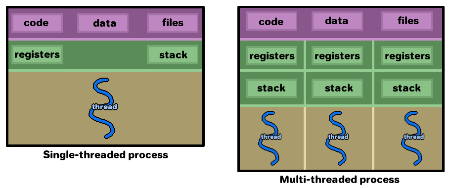
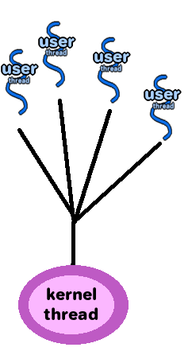
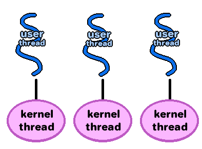
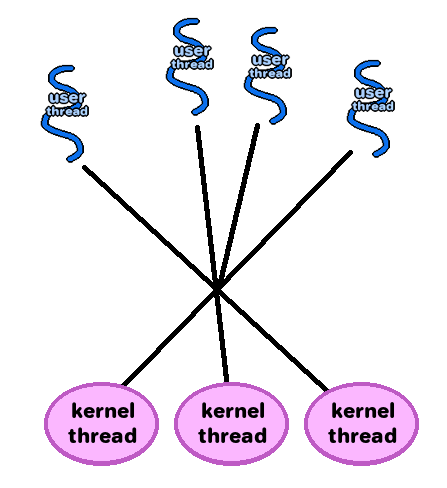

# Chapter 4: Threads

Rachel's summary notes

* [Official book slides - Chapter 4](http://codex.cs.yale.edu/avi/os-book/OS9/slide-dir/PPT-dir/ch4.ppt)

## Lab

T.A. mentioned that we should be familiar with these terms. **(IMPORTANT)**

* [Reentrancy](https://en.wikipedia.org/wiki/Reentrancy_(computing)
* [Thread safety](https://en.wikipedia.org/wiki/Thread_safety)

We are dealing with a non-thread-safe function (inc_count) in Lab 5.

## Vocabulary

* Atomic
* [Threads](https://en.wikipedia.org/wiki/Thread_(computing))
* [Single-threaded process](https://en.wikipedia.org/wiki/Thread_(computing)#Single_threading)
* [Multi-threaded process](https://en.wikipedia.org/wiki/Thread_(computing)#Multithreading)
* Multicore/multiprocessor system
* Data parallelism
* Task parallelism
* User threads
* Kernel threads
* Green threads
* Multithreading models
	* One-to-one model
	* Many-to-many model
	* Many-to-one model
* Thread libraries
	* POSIX
* Pthreads, Windows threads, Java threads
* Implicit threading
* Thread pools
* OpenMP - Compiler directives and API
* Parallel regions
* Grand Central Dispatch - Apple's extentions to C, API
	* Blocks
	* Dispatch queue
	* Main queue
* Threading issues
	* fork() and exec()
	* Signal handling
		* Default signal handler
		* User-defined singal handler
		* Asynchronous procedure calls (APCs)
	* Thread cancellation
		* Target thread
		* Asynchronous cancellation
		* Deferred cancellation
		* Cancellation point
		* Cleanup handler
	* Thread-local storage (TLS)
	* Scheduler activations
		* Lightweight process (LWP)
		* Upcall, upcall handler

---

# Notes

## Threads

An individual thread has:

* Thread ID
* Counter
* Register set
* Stack

And the threads of a process share:

* Code section
* Data section
* OS resources (open files, signals)

### Benefits of multithreading

* **Responsiveness** - The program can continue executing even while
some process is working on something. e.g., don't let the UI get
blocked while processing something else (*COUGH*VISUALSTUDIO*COUGH*)
* **Resource sharing** - Processes share resources via message passing or
shared memory, while threads can share the resources of the process.
* **Economy** - Threads share the process' resources, so it is easier/
more economical to create threads and do context-switching.
* **Scalability** - Once we have multiprocessor architecture, multithreading
becomes even more powerful.

### Parallelism vs. Concurrency

* Parallelism - the system can perform more than one task at the same time.
* Concurrency - the system supports multiple tasks by allowing all tasks to progress.

### Programming challenges

* **Identifying tasks** - being able to split up tasks so that they can run concurrently
* **Balance** - making sure that different tasks perform equal work
* **Data splitting** - dividing data to be run on different cores.
* **Data dependency** - identifying task dependencies and making sure synchronization works for this dependency
* **Testing and debugging**

### Types of parallelism

* **Data parallelism** - Being able to split up data into subsets, and distributing
this data to multiple cores so that they can work on the same problem together.
* **Task parallelism** - Being able to divide tasks (threads) across multiple cores.

### Models

* **User threads** are above the kernel level and no support is given by the kernel.
* **Kernel threads** are managed by the operating system.

#### Many-to-one model

* Many user-level threads are mapped to one kernel thread.
* A threading library is used
* The threading library is in the user space
* Con: The entire process blocks if any thread makes a blocking system call.
* Con: Multiple threads cannot run in parallel because only one thread accesses the kernel.

#### One-to-one model

* Each user thread is mapped to a kernel thread.
* This allows other threads to run even if a blocking call is made by one thread.
* Threads can also run in parallel across multiple processors.
* Con: Creating a user thread means you also have to create a kernel thread. This adds overhead.

#### Many-to-many model

* Multiple user-level threads are mapped to an equal or smaller number of kernel threads.
* Benefits of one-to-one model with less overhead.

### Implicit threading

Implicit threading is where the compiler or run-time libraries handle
threading, rather than having developers do it at the application-development level.

#### Thread Pools

* When the process is created, a series of threads are also created and put into a pool.
* Once a task needs to be done, a thread is pulled from the pool (if available).
* Once the thread completes the work, the thread returns to the pool to wait for another request.
* If the pool has no available threads, then the program waits for one to become free.
* Pro: Cut out the overhead of creating new threads each time; already have threads created.
* Pro: The number of threads is limited.

#### OpenMP

#### Grand Central Dispatch

### Threading issues

#### fork and exec

* When fork() is called, should the threads be duplicated across the
processes, or should the new process be single-threaded?
* Some UNIX systems have two versions of fork().

#### Signal handling

When a signal is caught, where should it be handled?

* Deliver signal to the thread that spawned the signal?
* Deliver the signal to all threads of a process?
* Deliver the signal to only certain threads of a process?
* Assign a specific thread to receive all signals of a process?

#### Thread cancellation

A thread may end up being terminated before it completes...

* Asynchronous cancellation - one thread may terminate another
* Deferred cancellation - The target thread (to be terminated) will periodically
check to see whether it should terminate, which allows it to terminate itself
and cleanup

How do we deal with threads that are cancelled while data is being accessed?
(Written by the thread, read by other threads, etc...)

We can also use **deferred cancellation**...

* A thread will specify a target thread to be cancelled
* The target thread must toggle a flag in order to show that it is ready to be cancelled

With pthreads, we can use

	pthread_cancel()

though this is only a request. The target thread must have something set up
to handle the request.

The default cancellation type is deferred cancellation.

Another function that can be used is

	pthread_testcancel()

If cancellation is pending, then a cleanup handler is called.

#### Thread-local storage (aka TLS)

Sometimes threads just need their own data, not the stuff shared by all threads in the process.

TLS is similar to static data, but unique to each thread.

#### Scheduler activations

* Systems that use many-to-many threading model, or the two-level threading model, will usually have a data structure in between the User and the Kernel threads.
* This is the LWP (Lightweight Process).
* The LWP appears as a virtual processor to the user-thread library.
* Each LWP is attached to a kernel thread
* A user thread library can schedule a user thread via the virtual processor of the LWP.
* If a kernel thread blocks, then the LWP blocks.

One way for the user-level thread library to talk to the kernel is **scheduler activation**.

* The kernel provides a set of LWPs
* The application schedules user-threads to an available LWP virtual processor.
* The kernel has to let the application know about certain events (upcall).
* The upcall handler of a thread library handles upcalls.
* The upcall handler is run on a virtual processor.

---
