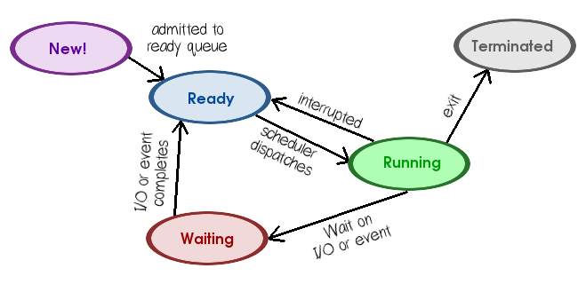

# Chapter 6: CPU Scheduling

Rachel's summary notes

* [Official book slides - Chapter 6](http://codex.cs.yale.edu/avi/os-book/OS9/slide-dir/PPT-dir/ch6.ppt)

---

# Notes

With CPU scheduling, our intent is to make our system work more efficiently
for systems that allow **multiprogramming**.

With a single processor system, only one process can run at a time,
and we use multiprogramming to run a secondary process while the 
"current" process is waiting on the completion of an I/O request.
This design is to minimize the amount of time that the CPU sits
around idle, resulting in wasted time with no work being executed.

Part of the design of our CPU scheduling deals with deciding which
thread to run next, how long to run a thread for, and at what point
to schedule the next thread to run.

## The CPU-I/O Burst Cycle

The execution of a process follows two states: **CPU Burst** and **I/O Burst**.

A **CPU Burst** is when the process is currently working, and **I/O Burst** is
the period of time that some Input or Output task is being handled.
A process jumps between these two states throughout its lifetime.

## The CPU Scheduler

The CPU Scheduler is responsible for choosing a "ready" process waiting
to be executed when the CPU is idle.

The CPU Scheduler is also known as the **short-term scheduler**.

There is a queue of processes in the **ready** state, though the design
of this queue is also a design challenge - is it simply a First-In, First-Out
Queue, a Priority Queue, or something else?

### Performance metrics for a CPU scheduler

There are several asepects of a CPU scheduler that one may take into account
when deciding how efficient a scheduling scheme is...:

* **CPU utilization** - The amount of time that the CPU is working.
* **Throughput** - The amount of jobs performed per some unit time.
* **Response-time (turn-around time)** - The time it takes to complete
a task, from the *ready* state to the *complete*/*terminated* state.
Another way of looking at this is the *sum* of the periods where the 
process was waiting to get into memory, waiting in the ready queue, executing,
and waiting on I/O.
* **Waiting time** - The amount of time a process spends in the
*ready queue* waiting to be processed.
* **Scheduling latency** - The time it takes to schedule a task,
going from the *ready* state to being scheduled for the first time.

*CPU utilization* and *Throughput* should preferably be high, while
*turnaround time*, *waiting time*, and *response time* should preferably be low.

However, we cannot min/max these aspects always; we may need to make
tradeoffs in order to make sure the CPU scheduler's average times are
adequate.

### Process lifetime

While a process is running in the CPU, its turn may end for one of several
reasons...:

* An **I/O request** is made
* Its **time slice** expires
* It **forks a child**
* It begins **waiting for an interrupt**

Once the reason has been resolved, the process returns to the **ready queue**
and waits its turn to be processed again.

The states of a process are as follows:

* **new**
* **ready**
* **running**
* **waiting**
* **terminated**

### CPU Decisions

The CPU scheduler will need to make a decision under the following scenarios:

1. Process goes from **running** -> **waiting**
	* No choice; a new process must be selected if any are in the ready queue.
2. Process goes from **running** -> **ready**
	* Decide whether to run that process again, or a different one.
3. Process goes from **waiting** -> **ready**
	* Decide whether to run that process, or a different one.
4. Process terminates
	* No choice; a new process must be selected if any are in the ready queue.

The way we design our scheduler will be **preemptive** or **nonpreemptive (cooperative)**
depending on its function: If we only schedule new tasks when a process goes
from *running* to *waiting*, or when a process *terminates*, then the scheduling
scheme is **nonpreemptive**. 

In the **nonpreemptive** case, the process maintains hold of the CPU
until it is either blocked (waiting on I/O or an event) or is finished;
it does not share its processing time with others while it is ready to run.

If our scheme is **preemptive**, where we share processing time between
multiple processes, we can run into **race conditions**, making
the scheduling more complex.

### The Dispatcher

The dispatcher is a component of the CPU scheduler. Once the short-term
scheduler has selected a process, the dispatcher gives control of the CPU
to this process.

The dispatcher has the following functionaliy:

* Switching contexts
* Switching to user mode
* Resuming a program by jumping to the location in the program where it left off.

The Dispatcher comes into play every time there is a process switch. Therefore,
we are also concerned with **dispatch latency**.

## Types of scheduling algorithms

There are different types of scheduling algorithms to consider.

### The Gantt chart

The Gantt chart is a way that we can illustrate a schedule.

### First-Come, First-Served Scheduling

* [Wikipedia article](https://en.wikipedia.org/wiki/Scheduling_(computing)#First_come.2C_first_serve)

The FCFS scheduling scheme is easy to implement, but not very efficient.

The first process that requests the CPU is the first process that receives
processing time. This means that for a set of multiple tasks passed in,
the resulting wait time can vary widely based on the order of these tasks.

A **Convoy Effect** may also occur, where one big process "leads the pack"
of smaller processes, as it is the resource hog and ends up blocking
the CPU while the smaller processes wait.

Also the FCFS scheduling scheme is **nonpreemptive**.

**CON:** The average response time sucks, and is also unreliable!

### Shortest-Job-First Scheduling

For this scheme, the process with the smallest next CPU burst
is scheduled. If two processes have the same CPU burst size,
then FCFS (first come first serve) is used to select which one goes.

The challenge here is *how to figure* the length of each process.

SJF scheduling is used more commonly with long-term job scheduling,
rather than as short-term CPU scheduling, as we cannot know how long
of a CPU burst a process will need.

**PRO:** Good average response time

**CON:** Can't predict the future

We can try to approximate this scheduling for short-term by estimating
the CPU burst length of a process. This might mean looking at how long
its last CPU burst took, and assume subsequent ones will be of similar length.
We use an **exponential weighted moving average** of the past CPU bursts
to estimate for future ones.

(And I really hope that we don't have to memorize the formula stuff.)

The SJF algorithm can be **preemptive** or **nonpreemptive**.
Preemptive SJF is also known as "Shortest-remaining-time-first scheduling".

We might also have to account for processes not arriving at the same time.
So it might be better to think of this as "shortest remaining time first",
and allow the scheduling to be preemptive so that processes can be scheduled
more efficiently.

### Priority Scheduling

Priority scheduling is simply selecting the next process based on its
given *priority*. The SJF algorithm is a *type of* priority scheduling.

In the textbook we use for class, they use **low numbers** to represent
items of **high priority**.

Priority of a process can be defined either internally or externally.

Internal priority may come from # of files open by the process,
average I/O burst time : average CPU burst time, a time limit, or
memory requirements.

External priority may come from the user-defined importance of the process.

The textbook seems a bit salty about acadmic politics and funding here.

Additionally, priority scheduling can be preemptive or nonpreemptive.

**CONS:** A problem that occurs with priority scheduling is the threat of
starvation. This means that a process is constantly preempted by higher-priority
items, and it never receives any processing time.

One way to combat this is by **aging** the process - increasing its
priority the longer it lives, so that it will eventually get some processing time.

### Round-Robin Scheduling

* [Wikipedia article](https://en.wikipedia.org/wiki/Scheduling_(computing)#Round-robin_scheduling)

### Multilevel Queue Scheduling

* [Wikipedia article](https://en.wikipedia.org/wiki/Scheduling_(computing)#Multilevel_queue_scheduling)

### Multilevel Feedback Queue Scheduling

---

# Vocabulary

* Basic concepts
	* CPU-I/O Burst Cycle
		* Cycle
		* CPU burst
		* I/O burst
	* CPU scheduler
		* Short-term scheduler
	* Preemptive scheduling
* Scheduling schemes
	* Nonpreemptive
	* Cooperative
	* Preemptive
* Dispatch latency
* Scheduling criteria
* Scheduling algorithms
	* First-Come, First-Served scheduling (FCFS)
		* Gantt chart
		* Convoy effect
	* Shortest-Job-First scheduling (SJF) aka Shortest-Remaining-Time-First
		* Exponential average
	* Priority scheduling
		* Indefinite blocking / starvation
		* Aging
	* Round-Robin scheduling (RR)
		* Time quantum / time slice
	* Multilevel Queue scheduling
		* Foreground (interactive) processes
		* Background (batch) processes
	* Multilevel Feedback Queue scheduling
* Thread scheduling
	* Process-contention scope (PCS)
	* System-contention scope (SCS)
* Multiple-processor scheduling
	* Load sharing
	* Asymmetric multiprocessing
	* Symmetric multiprocessing (SMP)
	* Processor affinity
		* Soft affinity
		* Hard affinity
	* Load balancing
		* Push migration
		* Pull migration
	* Multicore processors
		* Memory stall
		* Coarse-grained
		* Fine-grained
* Real-time CPU Scheduling
	* Soft real-time systems
	* Hard real-time systems
	* Event latency
		* Interrupt latency
		* Dispatch latency
		* Conflict phase
	* Priority-based Scheduling
		* Periodic
		* Rate
		* Admission-control algorithm
	* Rate-monotonic scheduling
	* Earliest-Deadline-First scheduling (EDF)
	* Proportional Share scheduling
	* POSIX Real-Time scheduling
* Operating system examples
	* Linux
		* Completely Fair Scheduler
		* Scheduling classes
		* Nice value
		* Targeted latency
		* Virtual run time
	* Windows
		* Dispatcher
		* Variable class
		* Real-time class
		* Idle thread
		* Foreground process
		* Background process
		* User-mode scheduling (UMS)
		* Fibers
		* Concurrency Runtime (ConcRT)
	* Solaris
* Algorithm evaluation
	* Deterministic modeling
		* Analytic evaluation
		* Deterministic modeling
	* Queueing models
		* Queueing-network analysis
		* Little's formula
	* Simulations
		* Trace tapes
	* Implementation
