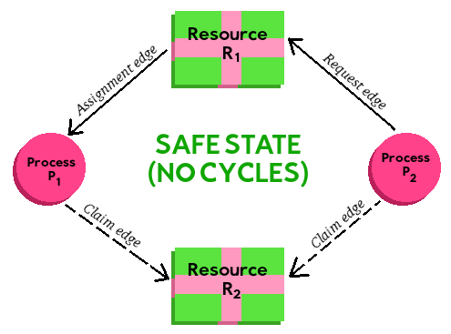
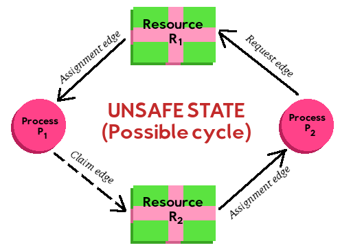

# Chapter 

Rachel's summary notes

* [Official book slides - Chapter 7](http://codex.cs.yale.edu/avi/os-book/OS9/slide-dir/PPT-dir/ch7.ppt)

---

# Notes

## Deadlocks

	In concurrent computing, a deadlock is a state in which each member 
	of a group of actions, is waiting for some other member to release 
	a lock.

	From https://en.wikipedia.org/wiki/Deadlock

For a deadlock to occur, all four of the following conditions must be met:

1. **Mutual exclusion**
2. **Hold and wait**
3. **No preemption**
4. **Circular wait** - Process A may be waiting for a region to be freed by
Process B, and vice versa, meaning that neither ever gain access to the area
that they want.

### Resource-allocation graphs

## Managing deadlock problems

### Handling deadlocks

We can handle deadlocks in one of three ways: By making sure we can
never enter a deadlocked state, by detecting a deadlocked state and
resolving it, and to ignore the possibility of deadlocks.

### Deadlock prevention

To implement deadlock prevention, we need to make sure that at least one
of the three deadlock conditions cannot occur.

#### We cannot prevent "mutual exclusion"

This condition must be true - otherwise, if we didn't have critical sections,
why would be worried about multithreading and synchronization to begin with?

#### Preventing "hold and wait"

To prevent the "hold and wait" condition, we must make sure that a process
can only work with one resource at a time, and not be taking up multiple
resources that other processes may need while it is doing its work,
or not request additional resources that it didn't specify when it first began.

**Option 1:** We can have the process request all the resources it will need ahead of time,
so that no new resources are requested "unexpectedly" that others might need
during its lifetime.

**Option 2:** We can only allow the process to have one resource at a
time, and only be able to request resources when that process is not currently
holding any resources.

* **CONS:** 
	* Resource utilization can be low; resources go unused. 
	* Starvation is possible. If something needs multiple resources, 
	those various resources may always be taken up by other processes.

#### Preventing "no preemption"

For this method, if the current process is running and holding some resources,
and it needs some additional resources, if it must then hold and wait, then we
allow the resources of this process to be preempted while it is waiting.

This is mostly a decent choice if you can save and restore states easily.

#### Preventing "circular wait"

To prevent the circular wait, we order our resources.
Processes can only request resources in an increasing numerical order.

Therefore, certain resources have "prerequisites", and if you want a
resource you must also grab its prereqs.

The problem is that the application programmers have to make sure to
abide by this rule!

### Deadlock avoidance

To implement deadlock avoidance, the OS needs more information about processes
and the resources that they need ahead of time.

Generally, this might be the order in which resources are requested by
each program.

#### Safe state

For deadlock avoidance, we can be in a safe state or unsafe state.
An unsafe state may result in a deadlock, but it is not guaranteed.

The idea is to allow processes to run if the system will remain in 
a safe state. If a process wants resources, but allocating those resources
will cause the process to enter an *unsafe state*, then even though those
resources are free, it will not be allowed to start and take those
resources until a safe state is guaranteed.

#### Resource-allocation-graph algorithm

**Claim edge:** For nodes Pi and Rj if there
is an edge Pi → Rj, this means that process
Pi may request resource Rj. 

In a graph, the line is marked as a dashed line to show that
Pi may, in the future, request Rj.

Once Pi requests Rj, we convert the claim edge to a **request edge**.
Once the process is done with the resource, the request edge is changed to a claim edge.

**Request edge:** Once Pi requests Rj, then
we convert the dashed directional line to a solid directional line.

**Assignment edge:** If the request can be completed,
and we specify an assignment edge Rj → Pi
without creating a circle / cycle,
then we may allocate that resource.

For this graph, there are currently no cycles in the directions of
our edges, so this is currently in a *safe state:*

But once we allocate resource R2 to P2,
the diagram becomes a cycle and shows that this is an unsafe state.

#### Banker's algorithm

The banker's algorithm is not as efficient as the resource-allocation
graph scheme.

The idea behind this algorithm is that a banker shouldn't be in a state
where it cannot provide money to any of its customers.

A maximum amount of resources must be known when a new process enters
the system. When resources are requested, the state must be analyzed -
if the resources are provided, is the system left in a safe or unsafe state?

If it will be left in a safe state, then the resources will be given.
Otherwise, the requesting process must wait for more resources to be freed.

We need to keep track of the following data:

* **Available:** The amount of resources currently available.
The value of **`Available[j]`** is the amount of Resources
of type **Rj** available.

* **Max:** The maximum amount of resources that a process may ask for.
The value of **`Max[i][j]`** is the maximum amount of resources that can be
requested, for Process **Pi** and of Resource **Rj**.

* **Allocation:** The current amount of resources allocated to processes.
The value of **`Allocation[i][j]`** is the amount of resources allocated by
Process **Pi** of Resource type **Rj**

* **Need:** The remaining amount of resources needed by a process.
The value of **`Need[i][j]`** is the remaining amount of resources
that Process **Pi** may need of Resource type **Rj**.

#### The Safety Algorithm

	Define sizes:
		m: The amount of resource types
		n: The amount of processes
	
	Define:
		VECTOR		Work, 			size m
		VECTOR		Finish, 		size n
		VECTOR		Available,		size m
		MATRIX		Max,			size n x m
		MATRIX		Allocation,		size n x m
		MATRIX		Need,			size n x m
	
	1. Initialize:
		Work = Available
		Initialize all values of Finish (i=0 through n-1) to false.
	
	Algorithm: 
		2. Find an index i such that both...
			Finish[i] == false AND
			Need[i] <= Work
			
			If i is found:
				3. 	Work = Work + Allocation
					Finish[i] = true
					Go to step 2.
			
			If i doesn't exist:
				4. If Finish[i] == true for all values of i
					System is safe.
				
I'm not sure where the end state for unsafe is...

This algorithm is also pretty costly... will take *m x n2* operations
at worst case.

#### The Resource-Request Algorithm

This is an algorithm to determine if a request can be granted and
the system will remain in a safe state.

* **Requesti**: A vector of requests for Process **Pi**.
The value of **`Request[i][j]`** is the amount of instances of Resource type **Rj**
that it is requesting.

When Process **Pi** makes a request for Resource type **Rj**,
we need to do the following:

	1. If Request[i] <= Need:
	
		2. If Request[i] <= Available:
		
			3. Simulate the change by using the changes:
			
				Available = Available - Request
				Allocation[i] = Allocation[i] + Request[i]
				Need[i] = Need[i] - Request[i]
				
				If safe:
					Complete the transaction,
					allocate resources to P[i].
				
				Else:
					P[i] must wait for Request[i],
					restore previous state.
		
		Else: P[i] must wait; resource is not available
	
	Else: Error - process exceeded max claim

### Deadlock detection

Deadlock detection is required if we do not utilize deadlock avoidance or prevention.

We will need to be able to figue out whether a deadlock has occured by
examening the state of the system.

Being able to detect and recover from deadlocks also means additional overhead.
We have the cost of having to store information to be able to detect a deadlock,
but also the time it takes to analyze and resolve deadlocks.

#### Single instance of each resource type

#### Several instances of a resource type

#### Detection-algorithm usage

When do we use our detection algorithm? Well, how frequently might a 
deadlock occur? And, when it does happen, how many processes will it affect?

### Recovery from deadlock

Once we have detected that a deadlock has occurred, we need some manner to
resolve the problem. This is known as **recovery**.

#### Process termination

We can terminate a process in order to alieviate a deadlock. The system
will reclaim the resources used by the process in order to help other
processes continue.

* **Method 1: Abort all deadlocked processes** - This is expensive,
though it will definitely break the deadlock. Any works-in-progress are lost
and will be to be restarted.

* **Method 2: Abort one process at a time until the deadlock is elimiated**
- This will cost additional overhead since each time a process is terminated
the detector has to re-analyze the processes to look for deadlocks.

Additionally, terminating a process could corrupt data, such as a file
that was only partially written.

If we're only terminating one process at a time, we must also figure out
*which* process we want to kill. We may need to take into account the
process' priority, how long it has been running, what resources the
process is utilizing, what resources it needs, and whether the process
is foreground or background.

#### Resource preemption

For this method, we alieviate the deadlocks by preempting resources
that are needed by some of the deadlocked processes. We do this until
the deadlock is cleared.

This also has some challenges: Which process do we preempt and take its
resources from? If we preempt that process, do we restart the process or
otherwise roll it back to a safe state? And how do we ensure that
starvation does not occur, such as if a process is constantly being
preempted due to deadlocks.

---

# Vocabulary

* Deadlock
* System model
* Deadlock characterization
	* Necessary conditions
	* Resource-allocation graph
		* System resource-allocation graph
		* Request edge
		* Assignment edge
* Methods for handling deadlocks
	* Deadlock prevention
	* Deadlock avoidance
* Deadlock prevention
	* Mutual exclusion
	* Hold and wait
	* No preemption
	* Circular wait
* Deadlock avoidance
	* Safe state
	* Resource-Allocation-Graph algorithm
	* Banker's algorithm
* Deadlock detection
	* Single instance of each resource type
	* Several instances of each resource type
	* Detection-algorithm usage
* Recovery from deadlock
	* Process termination
	* Resource preemption
