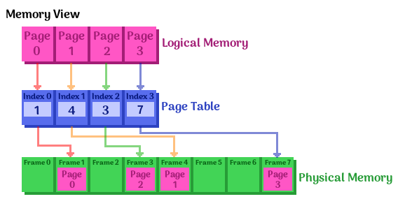

# Final Review

FML.

**SECTIONS:** 
[Final exam review](#final-exam-review) | 
[Problem set](#problem-set) | [Final exam postmortem](#final-exam-postmortem) | 
[Midterm exam analysis](#midterm-analysis)

**TABLE OF CONTENTS: Final Exam review topics**

*These topics are all items that were specifically mentioned in the
final exam review slides, or from the weekly Blackboard quizzes.
No extra information from the textbook. This is by strategy so as to not
waste time on topics that the teacher will not cover on the exam.*

<table>
<tr>
<th> <a href="#main-memory">    Main Memory        </a> </th>
<th> <a href="#virtual-memory"> Virtual Memory     </a> </th>
<th> <a href="#io-systems">     I/O Devices        </a> </th>
<th> <a href="#file-system">    File-system        </a> </th>
</tr>

<tr>

<td><ol> <!-- Main memory -->
<li> <a href="#paging"> Paging </a> </li>
<li> <a href="#memory-management-unit-mmu"> MMU </a> </li>
<li> <a href="#translation-lookaside-buffer-tlb"> TLB </a> </li>
<li> <a href="#multi-level-paging"> Multi-level paging </a> </li>
<li> <a href="#fragmentation"> Fragmentation </a> </li>
</ol></td>

<td><ol> <!-- Virtual memory -->
<li> <a href="#demand-paging"> Demand paging </a> </li>
<li> <a href="#page-faults"> Page faults </a> </li>
<li> <a href="#copy-on-write"> Copy-on-write </a> </li>
<li> <a href="#page-table-entry-pte-format"> Page table entry PTE </a> </li>
<li> <a href="#page-replacement--swapping"> Page replacement </a> </li>
<li> <a href="#least-recently-used-lru"> LRU algorithm </a> </li>
<li> <a href="#second-chance-algorithm"> Second-chance algorithm </a> </li>
<li> <a href="#thrashing"> Thrashing </a> </li>
</ol></td>

<td><ol> <!-- I/O devices -->
<li> <a href="#memory-mapped-io"> Memory-mapped I/O MMIO </a> </li>
<li> <a href="#programmed-io"> Programmed I/O </a> </li>
<li> <a href="#direct-memory-access-dma"> Direct memory access DMA </a> </li>
</ol></td>

<td><ol> <!-- File-system -->
<li> <a href="#inode"> inode </a> </li>
<li> <a href="#page-cache"> Page cache </a> </li>
<li> <a href="#journaling"> Journaling </a> </li>
</ol></td>

</tr>
</table>

<table>

<tr>
<th> <a href="#network">    Network    </a> </th>
<th> <a href="#security">    Security   </a> </th>
<th> <a href="#virtual-machine">    Virtual Machine   </a> </th>
<th> <a href="#main-memory">    Misc       </a> </th>
</tr>

<td><ol> <!-- Network -->
<li> <a href="#osi-7-layers"> OSI layers </a> </li>
<li> <a href="#tcpip-layers"> TCP/IP layers </a> </li>
<li> <a href="#layering-pros-and-cons"> Layering pros and cons </a> </li>
<li> <a href="#steps-to-sendreceive-packet"> Steps to send/receive packets </a> </li>
</ol></td>

<td><ol> <!-- Security -->
<li> <a href="#buffer-overflow-bugs"> Buffer overflow bugs </a> </li>
</ol></td>

<td><ol> <!-- Virtual Machine -->
<li> <a href="#virtual-machine-monitor-vmm"> Virtual machine monitor</a> </li>
<li> <a href="#native-vmm"> Native VMM </a> </li>
<li> <a href="#hosted-vmm"> Hosted VMM </a> </li>
<li> <a href="#full-virtualization"> Full virtualization </a> </li>
<li> <a href="#para-virtualization"> Para virtualization </a> </li>
</ol></td>

<td><ol> <!-- Misc -->
<li> <a href="#memory"> asdfasdf</a> </li>
</ol></td>

</table>

**PROBLEM SETS:**

*Example problems and their algorithms*

<table>
<tr>
<th> <a href="#problems-main-memory">    Main Memory        </a> </th>
<th> <a href="#problems-virtual-memory"> Virtual Memory     </a> </th>
<th> <a href="#problems-file-system">    File-system        </a> </th>
</tr>

<tr>

<td><ol> <!-- Main memory -->
<li> <a href="#calculate-size-of-single-page"> Calculate size of single page </a> </li>
<li> <a href="#calculate-virtual-address-space"> Calculate virtual address space </a> </li>
<li> <a href="#calculate-physical-address-space"> Calculate physical address space </a> </li>
<li> <a href="#address-translation"> Address translation </a> </li>
<li> <a href="#calculate-page-table-size"> Calculate page table size </a> </li>
<li> <a href="#calculate-required-page-table-size"> Calculate required page table size </a> </li>
<li> <a href="#calculate-bits-for-page-offset"> Calculate bits for page offset </a> </li>
<li> <a href="#entries-in-a-page-table"> Calculate entires in a page table </a> </li>
<li> <a href="#page-number-given-page-size-and-address"> Find page number given the page size and address </a> </li>
<li> <a href="#paging"> asdfasdfasdf </a> </li>
</ol></td>

<td><ol> <!-- Virtual memory -->
<li> <a href="#lru-replacement"> LRU algorithm page replacement </a> </li>
</ol></td>

<td><ol> <!-- File-system -->
<li> <a href="#disk-accesses-necessary"> Calculate necessary disk accesses </a> </li>
<li> <a href="#maximum-disk-size"> Calculate maximum disk size </a> </li>
<li> <a href="#maximum-size-of-a-file"> Calculate the maximum size of a file </a> </li>
<li> <a href="#disk-accesses-for-a-file-path"> Disk accesses for a file path </a> </li>
</ol></td>

</tr>
</table>


---

# Final Exam review

## Main memory

### Paging

The OS creates the page table and the hardware reads the page table.

Advantages are that there is no external fragmentation; there is
efficient use of memory. Internal fragmentation, however, may still exist.

**Operating system support:**

* The OS manages the MMU, and sometimes the TLB.
* The OS determines the address mapping

> In computing, virtual memory is a memory management technique that is implemented using both hardware and software. It maps memory addresses used by a program, called virtual addresses, into physical addresses in computer memory. Main storage as seen by a process or task appears as a contiguous address space or collection of contiguous segments. The operating system manages virtual address spaces and the assignment of real memory to virtual memory.
[Wikipedia](https://en.wikipedia.org/wiki/Virtual_memory)

**Paging issues:**

* Too big: Waste space, small table size
* Too small: Large table size, wasted space minimization
* Typical size: 4 KB

**Alternatives:**

* Many real-time operating systems don't have virtual memory.


### Memory-management unit (MMU)

> A memory management unit (MMU), sometimes called paged memory management unit (PMMU), is a computer hardware unit having all memory references passed through itself, primarily performing the translation of virtual memory addresses to physical addresses. It is usually implemented as part of the central processing unit (CPU), but it also can be in the form of a separate integrated circuit.

> An MMU effectively performs virtual memory management, handling at the same time memory protection, cache control, bus arbitration and, in simpler computer architectures (especially 8-bit systems), bank switching.
[Wikipedia](https://en.wikipedia.org/wiki/Memory_management_unit)


#### Segmentation MMU (base+limit)


**Simple MMU**, with some ```BaseAddr```, we get the ```PAddr``` with ```PAddr = VAddr + BaseAddr```.

This would be fast, but has no protection and it is wasteful.

The routine is only loaded as-needed, and not when it is not.


**Better MMU**:

* If ```VAddr > limit```:
	* Trap and report error
* Else:
	* ```PAddr = VAddr + BaseAddr```


This adds error detection, and we can trap an error.

This also supports variable-sized partitions.

However, it can lead to fragmentation.


#### Paging MMU (page tables)

* Physical memory is divided into fixed-sized blocks, which are called **frames**.
* Logical memory blocks are divided into fixed-sized blocks, which are called **pages**.
* page size = frame size
* A **page table** maps the pages onto frames.

		p: page number		d: page offset (BECAUSE THAT HAS A "d" ANYWHERE IN THE NAME...)

These addresses look like:


And the diagram for this MMU scheme:


And mapping looks like this:




#### Translation lookaside buffer (TLB)

> A Translation lookaside buffer (TLB) is a memory cache that is used to reduce
the time taken to access a user memory location.
[Wikipedia](https://en.wikipedia.org/wiki/Translation_lookaside_buffer)


### Multi-level paging

#### Two-level paging


### Fragmentation

> In computer storage, fragmentation is a phenomenon in which storage space is used inefficiently, reducing capacity or performance and often both
[Wikipedia](https://en.wikipedia.org/wiki/Fragmentation_(computing))

#### Internal fragmentation:

> Due to the rules governing memory allocation, more computer memory is sometimes allocated than is needed. For example, memory can only be provided to programs in chunks divisible by 4, 8 or 16, and as a result if a program requests perhaps 23 bytes, it will actually get a chunk of 32 bytes. When this happens, the excess memory goes to waste. In this scenario, the unusable memory is contained within an allocated region. This arrangement, termed fixed partitions, suffers from inefficient memory use - any process, no matter how small, occupies an entire partition. This waste is called internal fragmentation.

> Unlike other types of fragmentation, internal fragmentation is difficult to reclaim; usually the best way to remove it is with a design change. For example, in dynamic memory allocation, memory pools drastically cut internal fragmentation by spreading the space overhead over a larger number of objects.
[Wikipedia](https://en.wikipedia.org/wiki/Fragmentation_(computing)#Internal_fragmentation)


#### External fragmentation:

> External fragmentation arises when free memory is separated into small blocks and is interspersed by allocated memory. It is a weakness of certain storage allocation algorithms, when they fail to order memory used by programs efficiently. The result is that, although free storage is available, it is effectively unusable because it is divided into pieces that are too small individually to satisfy the demands of the application. The term "external" refers to the fact that the unusable storage is outside the allocated regions.

> For example, consider a situation wherein a program allocates 3 continuous blocks of memory and then frees the middle block. The memory allocator can use this free block of memory for future allocations. However, it cannot use this block if the memory to be allocated is larger in size than this free block.
[Wikipedia](https://en.wikipedia.org/wiki/Fragmentation_(computing)#External_fragmentation)


---

## Virtual memory

How the operating system makes it appear that there's more memory
than there actually is, so that each process thinks it has more memory than
is available.


### Demand paging

> In computer operating systems, demand paging (as opposed to anticipatory paging) is a method of virtual memory management. In a system that uses demand paging, the operating system copies a disk page into physical memory only if an attempt is made to access it and that page is not already in memory (i.e., if a page fault occurs). It follows that a process begins execution with none of its pages in physical memory, and many page faults will occur until most of a process's working set of pages is located in physical memory. This is an example of a lazy loading technique.
[Wikipedia](https://en.wikipedia.org/wiki/Demand_paging)


#### Page faults

> A page fault (sometimes called #PF, PF or hard fault[a]) is a type of exception raised by computer hardware when a running program accesses a memory page that is not currently mapped by the memory management unit (MMU) into the virtual address space of a process.
> When handling a page fault, the operating system generally tries to make the required page accessible at the location in physical memory, or terminates the program in case of an illegal memory access.
[Wikipedia](https://en.wikipedia.org/wiki/Page_fault)


#### Copy-on-write

> Copy-on-write (COW), sometimes referred to as implicit sharing[1] or shadowing,[2] is a resource-management technique used in computer programming to efficiently implement a "duplicate" or "copy" operation on modifiable resources.
> If a resource is duplicated but not modified, it is not necessary to create a new resource; the resource can be shared between the copy and the original. Modifications must still create a copy, hence the technique: the copy operation is deferred to the first write. By sharing resources in this way, it is possible to significantly reduce the resource consumption of unmodified copies, while adding a small overhead to resource-modifying operations.
[Wikipedia](https://en.wikipedia.org/wiki/Copy_on_write)

**Without copy-on-write:**

When we call ```fork()```, do we want to copy the entire parents' page onto new page frames?

* If the parent is using a lot of memory, then the ```fork()``` would take a long time.
* If ```exec()``` is immediately called after ```fork()```, then it was a waste!

**Copy-on-write:**

* Copy the *page table* of the parent instead. This is faster; the page table is smaller.
* Now both the parent and child are pointing to the same page table.
* Once the child or the parent wants to do a write, *then* we create a copy of
the page to write to, and the parent/child have separate versions of this page.
* Until written to, all pages are listed as *READ ONLY*. 
* Once a copy of the page is created during a write, both the page copies are set to *READ/WRITE*.

#### Page Table Entry (PTE) Format

<table>
<tr> <td> 1 bit </td> <td> 1 bit </td> <td> 1 bit </td> <td> 2 bits </td> <td> 20 bits </td> </tr>
<tr> <td> Valid bit (V) </td> <td> Modify bit (M) </td> <td> Reference bit (R) </td> <td> Protection bits (P) </td> <td> Page frame # </td> </tr>
</table>

* V:	Is this page in memory?
* M:	Has this page been modified?
* R:	Is this page being accessed?
* P:	Is this readable, writable, or executable?


### Page replacement & swapping

> In a computer operating system that uses paging for virtual memory management, page replacement algorithms decide which memory pages to page out (swap out, write to disk) when a page of memory needs to be allocated.
[Wikipedia](https://en.wikipedia.org/wiki/Page_replacement)

Page replacement is about deciding a *victim page* that will be removed,
to make space for the new page in memory.

Algorithms:

* **OPT: Theoretically optimal**
	* Where you evict the page that will go unused the longest. 
	* Need to read the future.
* NRU: Not recently used
* **LRU: Least recently used**
	* Look at history, and decide who hasn't been used for the longest period.
	* Good performance, but it is complex and requires hardware support.
* **FIFO: First-in, first-out**
	* Evict the oldest page first; 
	* fair, but can throw out frequently-used pages.
* **Second-chance**
	* Use the refrence bit to keep track of if an item was recently accessed.
	* See algorithm below.
* Clock
* Random 
	* Simple but unpredictable.
* Not frequently used
* Aging

#### Least Recently Used (LRU)

> LRU works on the idea that pages that have been most heavily used in the past few instructions are most likely to be used heavily in the next few instructions too.
> One important advantage of the LRU algorithm is that it is amenable to full statistical analysis. It has been proven, for example, that LRU can never result in more than N-times more page faults than OPT algorithm, where N is proportional to the number of pages in the managed pool.
> On the other hand, LRU's weakness is that its performance tends to degenerate under many quite common reference patterns. For example, if there are N pages in the LRU pool, an application executing a loop over array of N + 1 pages will cause a page fault on each and every access.
[Wikipedia](https://en.wikipedia.org/wiki/Page_replacement#Least_recently_used)

Look at history, and decide who hasn't been used for the longest period.

Good performance, but it is complex and requires hardware support.

Implementations:

* Record a **timestamp** when a page is accessed. Select the oldest page to remove.
* Keep a **list** of pages, in order of access time. More recently used towards head, least recenlty used towards back. The tail is the least-recently-used page.


#### Second-chance algorithm

<table>
<tr> <td> 1 bit </td> <td> 1 bit </td> <td> 1 bit </td> <td> 2 bits </td> <td> 20 bits </td> </tr>
<tr> <td> Valid bit (V) </td> <td> Modify bit (M) </td> <td> Reference bit (R) </td> <td> Protection bits (P) </td> <td> Page frame # </td> </tr>
</table>

* Replace one of the *old pages*, but not necessarily the *oldest page*.
* Reference bit is used by the MMU.
* List page frames in a circularly linked list (?)

Page fault:

1. Advance the "next victim" pointer by one space
1. Check the reference bit of the item the "next victim" pointer is pointing to
1. If R is 1:
	1. Set R to 0.
	1. Move "next victim" pointer by one space.
1. Else:
	1. This victim is selected.
	1. End it.

#### Thrashing

> In computer science, thrashing occurs when a computer's virtual memory subsystem is in a constant state of paging, rapidly exchanging data in memory for data on disk, to the exclusion of most application-level processing.[1] This causes the performance of the computer to degrade or collapse. The situation may continue indefinitely until the underlying cause is addressed.
[Wikipedia](https://en.wikipedia.org/wiki/Thrashing_(computer_science))

---

## I/O systems

* Block devices
	* High speed
	* Block/sector-level access
	* Hard drives, CD drives, USB flash drives
* Character devices
	* Low speed
	* Character-level access
	* Input devices: Keyboard, mouse, gamepad, joystick
* Network devices
	* Socket interface
	* Ethernet, wifi, bluetooth

Magnetic disks have a long seek time because they have to physically access
a record on the disk.

Solid state disks have zero seek time because there is no physical movement aspect.

The performance metrics that we care about are access latency, as well as
storage space offered and the price of the medium.

The **CPU** talks to devices via either **I/O instructions** or
by **Memory Mapped I/O (MMIO)**.

We also care about **Programmed I/O (PIO)** vs. **Direct Memory Access (DMA)**.

### I/O instructions


### Memory-mapped I/O

> Memory-mapped I/O (not to be confused with memory-mapped file I/O) uses the same address space to address both memory and I/O devices. The memory and registers of the I/O devices are mapped to (associated with) address values. So when an address is accessed by the CPU, it may refer to a portion of physical RAM, but it can also refer to memory of the I/O device. Thus, the CPU instructions used to access the memory can also be used for accessing devices. Each I/O device monitors the CPU's address bus and responds to any CPU access of an address assigned to that device, connecting the data bus to the desired device's hardware register.
[Wikipedia](https://en.wikipedia.org/wiki/Memory_mapped_I/O)

<table class="wikitable floatright" style="margin-left: 1.5em;">
<caption>A sample system memory map</caption>
<tr>
<th>Address range (<a href="/wiki/Hexadecimal" title="Hexadecimal">hexadecimal</a>)</th>
<th>Size</th>
<th>Device</th>
</tr>
<tr>
<th>0000–7FFF</th>
<td>32&#160;KiB</td>
<td>RAM</td>
</tr>
<tr>
<th>8000–80FF</th>
<td>256&#160;bytes</td>
<td>General-purpose I/O</td>
</tr>
<tr>
<th>9000–90FF</th>
<td>256&#160;bytes</td>
<td>Sound controller</td>
</tr>
<tr>
<th>A000–A7FF</th>
<td>2&#160;KiB</td>
<td>Video controller/text-mapped display RAM</td>
</tr>
<tr>
<th>C000–FFFF</th>
<td>16&#160;KiB</td>
<td>ROM</td>
</tr>
</table>

[Table from Wikipedia](https://en.wikipedia.org/wiki/Memory_mapped_I/O#Examples)


### Data transfer methods

#### Programmed I/O

> For programmed I/O, the software that is running on the CPU uses instructions that access I/O address space to perform data transfers to or from an I/O device (Memory-Mapped I/O).
> The best known example of a PC device that uses programmed I/O is the ATA interface
[Wikipedia](https://en.wikipedia.org/wiki/Programmed_input/output)

So PIO uses the CPU's **load and store** instructions. The hardware to implement this
is simple, but it ends up taking a lot of processing power from the CPU.

#### Direct Memory Access (DMA)

> Direct memory access (DMA) is a feature of computer systems that allows certain hardware subsystems to access main system memory (RAM), independent of the central processing unit (CPU).
> With DMA, the CPU first initiates the transfer, then it does other operations while the transfer is in progress, and it finally receives an interrupt from the DMA controller when the operation is done. 
> This feature is useful at any time that the CPU cannot keep up with the rate of data transfer, or when the CPU needs to perform useful work while waiting for a relatively slow I/O data transfer. Many hardware systems use DMA, including disk drive controllers, graphics cards, network cards and sound cards. DMA is also used for intra-chip data transfer in multi-core processors.
[Wikipedia](https://en.wikipedia.org/wiki/Direct_memory_access)

Our devices are able to directly access the DRAM, and it interrupts the CPU
once it is done.

The hardware here is more complicated, but the CPU only needs to be flagged
once the device is done with its I/O.

**Six-step process to perform DMA transfer**

These steps are taken from the [official book slides](http://codex.cs.yale.edu/avi/os-book/OS9/slide-dir/index.html),
Chapter 13: I/O systems, Slide 15.
Textbook/slides from Operating Systems Concepts, Silberschatz, Galvin, and Gagne, 2013.

> 1. Device driver is told to transfer disk data to buffer at address *X*
> 2. Device driver tells disk controller to transfer *C* bytes from disk to buffer at address *X*
> 3. Disk controller initiates DMA transfer
> 4. Disk controller sends each byte to the DMA controller
> 5. DMA controller transfers bytes to buffer *X*, increasing memory address and decreasing *C* until *C* = 0.
> 6. When *C = 0*, DMA interrupts CPU to signal transfer completion.

---

## File-system

When designing a file system, we need to figure out some method for *disk allocation*, such as:

* Continuous allocation
    * We have items mapped in a contiguous array of "blocks".
    * This allows fast sequential access and easy random access, similar how to a
    static array in memory would be.
    * However, is it suseptible to **external fragmentation**,
    and it is difficult to increase (the amount of space? or a block? It doesn't say!)
    
* **Linked allocation**
    * Similar to a linked list data structure, where different parts of a list
    may be contained in non-concurrent blocks of memory.
    * In this case, we're talking about the filesystem, so each block
    doesn't have to be contiguous, and the block holds a pointer to the next block.
    * Easy to grow if more space is needed (I assume for a file).
    * Access performance sucks because you have to traverse, like a linked list.
    
* **Indexed allocation**
    * For this, there's a directory that lists the files.
    * The entry in the directory table lists the *index block*.
    * The *index block* contains pointers to all the blocks that the file uses.
    * This prevents external fragmentation, and fast random access.
    * However, there is an overhead on space, because we're storing this extra data.
    * There's also a limit on the file size (probably by the size of an index block.)


### Fragmentation

> In computer storage, fragmentation is a phenomenon in which storage space is used inefficiently, reducing capacity or performance and often both. The exact consequences of fragmentation depend on the specific system of storage allocation in use and the particular form of fragmentation. In many cases, fragmentation leads to storage space being "wasted", and in that case the term also refers to the wasted space itself.
[Wikipedia](https://en.wikipedia.org/wiki/Fragmentation_(computing))

**Internal fragmentation:**

> Due to the rules governing memory allocation, more computer memory is sometimes allocated than is needed. For example, memory can only be provided to programs in chunks divisible by 4, 8 or 16, and as a result if a program requests perhaps 23 bytes, it will actually get a chunk of 32 bytes. When this happens, the excess memory goes to waste. In this scenario, the unusable memory is contained within an allocated region. This arrangement, termed fixed partitions, suffers from inefficient memory use - any process, no matter how small, occupies an entire partition. This waste is called internal fragmentation.[1][2]

> Unlike other types of fragmentation, internal fragmentation is difficult to reclaim; usually the best way to remove it is with a design change. For example, in dynamic memory allocation, memory pools drastically cut internal fragmentation by spreading the space overhead over a larger number of objects.

[Wikipedia](https://en.wikipedia.org/wiki/Fragmentation_(computing)#Internal_fragmentation)

**External fragmentation:**

> External fragmentation arises when free memory is separated into small blocks and is interspersed by allocated memory. It is a weakness of certain storage allocation algorithms, when they fail to order memory used by programs efficiently. The result is that, although free storage is available, it is effectively unusable because it is divided into pieces that are too small individually to satisfy the demands of the application. The term "external" refers to the fact that the unusable storage is outside the allocated regions.
[Wikipedia](https://en.wikipedia.org/wiki/Fragmentation_(computing)#External_fragmentation)

### Metadata

### inode

> The inode is a data structure in a Unix-style file system that describes a filesystem object such as a file or a directory. Each inode stores the attributes and disk block location(s) of the object's data.[1] Filesystem object attributes may include metadata (times of last change,[2] access, modification), as well as owner and permission data.[3]
> Directories are lists of names assigned to inodes. A directory contains an entry for itself, its parent, and each of its children.
[Wikipedia](https://en.wikipedia.org/wiki/Inode)

### Direct/single/double/triple indirect blocks

### Storage caches

Can have caches for the diretory and for the buffer in order to speed things up;
a **Directory Cache** helps with speeding up name resolution , and a
**Buffer Cache** caches frequently used disk blocks.

### Unified buffer

### Page cache

> In computing, a page cache, sometimes also called disk cache,[2] is a transparent cache for the pages originating from a secondary storage device such as a hard disk drive (HDD). The operating system keeps a page cache in otherwise unused portions of the main memory (RAM), resulting in quicker access to the contents of cached pages and overall performance improvements. A page cache is implemented in kernels with the paging memory management, and is mostly transparent to applications.
[Wikipedia](https://en.wikipedia.org/wiki/Page_cache)

### Journaling

> A journaling file system is a file system that keeps track of changes not yet committed to the file system's main part by recording the intentions of such changes in a data structure known as a "journal", which is usually a circular log. In the event of a system crash or power failure, such file systems can be brought back online more quickly with a lower likelihood of becoming corrupted.
[Wikipedia](https://en.wikipedia.org/wiki/Journaling_file_system)

---

## Network

### OSI 7 Layers

> The Open Systems Interconnection model (OSI model) is a conceptual model that characterizes and standardizes the communication functions of a telecommunication or computing system without regard to their underlying internal structure and technology.
[Wikipedia](https://en.wikipedia.org/wiki/OSI_layers)

<table class="wikitable" style="margin: 1em auto 1em auto;">
<tr>
<th colspan="5">OSI Model</th>
</tr>
<tr>
<th colspan="2">Layer</th>
<th><a href="/wiki/Protocol_data_unit" title="Protocol data unit">Protocol data unit</a> (PDU)</th>
<th style="width:30em;">Function<sup id="cite_ref-3" class="reference"><a href="#cite_note-3">[3]</a></sup></th>
</tr>
<tr>
<th rowspan="4">Host<br />
layers</th>
<td style="background:#d8ec9b;">7.&#160;<a href="/wiki/Application_layer" title="Application layer">Application</a></td>
<td style="background:#d8ec9c;" rowspan="3"><a href="/wiki/Data_(computing)" title="Data (computing)">Data</a></td>
<td style="background:#d8ec9c;"><small>High-level <a href="/wiki/API" class="mw-redirect" title="API">APIs</a>, including resource sharing, remote file access</small></td>
</tr>
<tr>
<td style="background:#d8ec9b;">6.&#160;<a href="/wiki/Presentation_layer" title="Presentation layer">Presentation</a></td>
<td style="background:#d8ec9b;"><small>Translation of data between a networking service and an application; including <a href="/wiki/Character_encoding" title="Character encoding">character encoding</a>, <a href="/wiki/Data_compression" title="Data compression">data compression</a> and <a href="/wiki/Encryption" title="Encryption">encryption/decryption</a></small></td>
</tr>
<tr>
<td style="background:#d8ec9b;">5. <a href="/wiki/Session_layer" title="Session layer">Session</a></td>
<td style="background:#d8ec9b;"><small>Managing communication <a href="/wiki/Session_(computer_science)" title="Session (computer science)">sessions</a>, i.e. continuous exchange of information in the form of multiple back-and-forth transmissions between two nodes</small></td>
</tr>
<tr>
<td style="background:#e7ed9c;">4. <a href="/wiki/Transport_layer" title="Transport layer">Transport</a></td>
<td style="background:#e7ed9c;"><a href="/wiki/Packet_segmentation" title="Packet segmentation">Segment</a> (TCP) / <a href="/wiki/Datagram" title="Datagram">Datagram</a> (UDP)</td>
<td style="background:#e7ed9c;"><small>Reliable transmission of data segments between points on a network, including <a href="/wiki/Packet_segmentation" title="Packet segmentation">segmentation</a>, <a href="/wiki/Acknowledgement_(data_networks)" title="Acknowledgement (data networks)">acknowledgement</a> and <a href="/wiki/Multiplexing" title="Multiplexing">multiplexing</a></small></td>
</tr>
<tr>
<th rowspan="3">Media<br />
layers</th>
<td style="background:#eddc9c;">3. <a href="/wiki/Network_layer" title="Network layer">Network</a></td>
<td style="background:#eddc9c;"><a href="/wiki/Network_packet" title="Network packet">Packet</a></td>
<td style="background:#eddc9c;"><small>Structuring and managing a multi-node network, including <a href="/wiki/Address_space" title="Address space">addressing</a>, <a href="/wiki/Routing" title="Routing">routing</a> and <a href="/wiki/Network_traffic_control" title="Network traffic control">traffic control</a></small></td>
</tr>
<tr>
<td style="background:#e9c189;">2. <a href="/wiki/Data_link_layer" title="Data link layer">Data link</a></td>
<td style="background:#e9c189;"><a href="/wiki/Frame_(networking)" title="Frame (networking)">Frame</a></td>
<td style="background:#e9c189;"><small>Reliable transmission of data frames between two nodes connected by a physical layer</small></td>
</tr>
<tr>
<td style="background:#e9988a;">1. <a href="/wiki/Physical_layer" title="Physical layer">Physical</a></td>
<td style="background:#e9988a;"><a href="/wiki/Bit" title="Bit">Bit</a></td>
<td style="background:#e9988a;"><small>Transmission and reception of raw bit streams over a physical medium</small></td>
</tr>
</table>

[Table from Wikipedia](https://en.wikipedia.org/wiki/OSI_layers#Description_of_OSI_layers)

### TCP/IP Layers

> The Internet protocol suite is the conceptual model and set of communications protocols used on the Internet and similar computer networks. It is commonly known as TCP/IP because the original protocols in the suite are the Transmission Control Protocol (TCP) and the Internet Protocol (IP).
[Wikipedia](https://en.wikipedia.org/wiki/TCPIP)

**Link layer**

> The link layer has the networking scope of the local network connection to which a host is attached.
[Wikipedia](https://en.wikipedia.org/wiki/TCPIP#Link_layer)

**Internet layer**

> The internet layer has the responsibility of sending packets across potentially multiple networks. Internetworking requires sending data from the source network to the destination network. This process is called routing.
[Wikipedia](https://en.wikipedia.org/wiki/TCPIP#Internet_layer)

**Transport layer**

> The transport layer establishes basic data channels that applications use for task-specific data exchange. The layer establishes process-to-process connectivity, meaning it provides end-to-end services that are independent of the structure of user data and the logistics of exchanging information for any particular specific purpose.
[Wikipedia](https://en.wikipedia.org/wiki/TCPIP#Transport_layer)

**Application layer**

> The application layer includes the protocols used by most applications for providing user services or exchanging application data over the network connections established by the lower level protocols, but this may include some basic network support services, such as many routing protocols, and host configuration protocols. Examples of application layer protocols include the Hypertext Transfer Protocol (HTTP), the File Transfer Protocol (FTP), the Simple Mail Transfer Protocol (SMTP), and the Dynamic Host Configuration Protocol (DHCP).
[Wikipedia](https://en.wikipedia.org/wiki/TCPIP#Application_layer)

### Layering pros and cons

[Comparison of TCP/IP and OSI layering @ Wikipedia](https://en.wikipedia.org/wiki/TCPIP#Comparison_of_TCP.2FIP_and_OSI_layering)

For OSI layers, a pro is that there is a separation of concerns, but the
cons are that there is overhead and duplication.

### Steps to send/receive packet

**Sending a packet**

1. Application layer:
    1. Application writes to the socket
    1. INet checks socket
    1. Socket writes to protocol
1. Transport layer:
    1. TCP creates packet buffer
    1. TCP flils in header
1. Internet layer:
    1. IP gets socket data
    1. IP fills in header
1. Link layer:
    1. Packet goes on queue
    1. Scheduler runs device driver
    1. Device prepares, sends packet
    1. Packet goes out on medium.

[From G. Herrin, Linux IP Networking: A Guide to the Implementation and Modification of the Linux Protocol Stack, 2000](http://oai.dtic.mil/oai/oai?verb=getRecord&metadataPrefix=html&identifier=ADA377980)

**Receiving a packet**

1. Link layer:
    1. Packet arrives on medium
    1. Device checks, stores packet
    1. Packet goes on backlog queue
    1. (Wait for scheduler)
    1. Scheduler runs "bottom half"
    1. net_bh pops packet queue
    1. net_bh matches protocol (IP)
1. Internet layer:
    1. IP checks for errors
1. Transport layer:
    1. TCP checks for errors
    1. Packet goes in socket queue
1. Application layer:
    1. Application reads from socket
    1. Socket reads from queue
    
[From G. Herrin, Linux IP Networking: A Guide to the Implementation and Modification of the Linux Protocol Stack, 2000](http://oai.dtic.mil/oai/oai?verb=getRecord&metadataPrefix=html&identifier=ADA377980)

---

## Security

### Buffer overflow bugs

Stack overflow:

> In software, a stack overflow occurs if the call stack pointer exceeds the stack bound. 
[Wikipedia](https://en.wikipedia.org/wiki/Stack_overflow)

Buffer overflow:

> In computer security and programming, a buffer overflow, or buffer overrun, 
is an anomaly where a program, while writing data to a buffer, 
overruns the buffer's boundary and overwrites adjacent memory locations. 
[Wikipedia](https://en.wikipedia.org/wiki/Buffer_overflow)

**The jump to address stored in a register technique**

> The "jump to register" [...] strategy is to overwrite the return pointer 
with something that will cause the program to jump to a known pointer stored 
within a register which points to the controlled buffer and thus the shellcode.
[Wikipedia](https://en.wikipedia.org/wiki/Buffer_overflow#The_jump_to_address_stored_in_a_register_technique)

These overflows are a way that an attacker can gain access,
by unauthorized user or privilege escalation.

**Example from [Wikipedia](https://en.wikipedia.org/wiki/Buffer_overflow#Example)**

> In the following example expressed in C, a program has two data which are adjacent in memory:
an 8-byte-long string buffer, A, and a two-byte big-endian integer, B.

```c
char           A[8] = "";
unsigned short B    = 1979;
```
> Initially, A contains nothing but zero bytes, and B contains the number 1979

<table class="wikitable" style="width:32em; text-align:center;">
<tr>
<th style="white-space:nowrap;">variable name</th>
<th colspan="8" style="background:#ddf;">A</th>
<th colspan="2" style="background:#fdd;">B</th>
</tr>
<tr style="background:#ddf;">
<th>value</th>
<td colspan="8">[<a href="/wiki/Null_string" class="mw-redirect" title="Null string">null string</a>]</td>
<td colspan="2" style="background:#fdd;"><tt>1979</tt></td>
</tr>
<tr style="background:#ddf;">
<th>hex value</th>
<td><tt>00</tt></td>
<td><tt>00</tt></td>
<td><tt>00</tt></td>
<td><tt>00</tt></td>
<td><tt>00</tt></td>
<td><tt>00</tt></td>
<td><tt>00</tt></td>
<td><tt>00</tt></td>
<td style="background:#fdd;"><tt>07</tt></td>
<td style="background:#fdd;"><tt>BB</tt></td>
</tr>
</table>

> Now, the program attempts to store the null-terminated string "excessive" with ASCII encoding in the A buffer.

```c
strcpy(A, "excessive");
```

> "excessive" is 9 characters long and encodes to 10 bytes including the null terminator, but A can take only 8 bytes. By failing to check the length of the string, it also overwrites the value of B:

<table class="wikitable" style="width:32em; text-align:center;">
<tr>
<th style="white-space:nowrap;">variable name</th>
<th colspan="8" style="background:#ddf;">A</th>
<th colspan="2" style="background:#fdd;">B</th>
</tr>
<tr style="background:#ddf;">
<th>value</th>
<td><tt>'e'</tt></td>
<td><tt>'x'</tt></td>
<td><tt>'c'</tt></td>
<td><tt>'e'</tt></td>
<td><tt>'s'</tt></td>
<td><tt>'s'</tt></td>
<td><tt>'i'</tt></td>
<td><tt>'v'</tt></td>
<td colspan="2" style="background:#dbd;"><tt>25856</tt></td>
</tr>
<tr style="background:#ddf;">
<th>hex</th>
<td><tt>65</tt></td>
<td><tt>78</tt></td>
<td><tt>63</tt></td>
<td><tt>65</tt></td>
<td><tt>73</tt></td>
<td><tt>73</tt></td>
<td><tt>69</tt></td>
<td><tt>76</tt></td>
<td style="background:#dbd;"><tt>65</tt></td>
<td style="background:#dbd;"><tt>00</tt></td>
</tr>
</table>

> B's value has now been inadvertently replaced by a number formed from part of the character string. In this example "e" followed by a zero byte would become 25856.

> Writing data past the end of allocated memory can sometimes be detected by the operating system to generate a segmentation fault error that terminates the process.

> To prevent the buffer overflow from happening in this example, the call to strcpy could be replaced with strncpy, which takes the maximum capacity of A as an additional parameter and ensures that no more than this amount of data is written to A:

```c
strncpy(A, "excessive", sizeof(A));
```

---

## Virtual Machine

### Virtual machine monitor VMM

> A hypervisor or virtual machine monitor (VMM) is computer software, firmware, or hardware, that creates and runs virtual machines.
[Wikipedia](https://en.wikipedia.org/wiki/Virtual_machine_monitor)

#### Native VMM

Otherwise known as "Type-1 hypervisors"

> These hypervisors run directly on the host's hardware to control the hardware and to manage guest operating systems.
[Wikipedia](https://en.wikipedia.org/wiki/Virtual_machine_monitor#Classification)

#### Hosted VMM

Otherwise known as "Type-2 hypervisors"

> These hypervisors run on a conventional operating system (OS) just as other computer programs do. A guest operating system runs as a process on the host. Type-2 hypervisors abstract guest operating systems from the host operating system. VMware Workstation, VMware Player, VirtualBox, Parallels Desktop for Mac and QEMU are examples of type-2 hypervisors
[Wikipedia](https://en.wikipedia.org/wiki/Virtual_machine_monitor#Classification)


#### Full virtualization

> In computer science, full virtualization is a virtualization technique used to provide a certain kind of virtual machine environment, namely, one that is a complete simulation of the underlying hardware. Full virtualization requires that every salient feature of the hardware be reflected into one of several virtual machines – including the full instruction set, input/output operations, interrupts, memory access, and whatever other elements are used by the software that runs on the bare machine, and that is intended to run in a virtual machine.
> A key challenge for full virtualization is the interception and simulation of privileged operations, such as I/O instructions. The effects of every operation performed within a given virtual machine must be kept within that virtual machine – virtual operations cannot be allowed to alter the state of any other virtual machine, the control program, or the hardware.
[Wikipedia](https://en.wikipedia.org/wiki/Full_virtualization)

#### Para virtualization

> In computing, paravirtualization is a virtualization technique that presents a software interface to virtual machines that is similar, but not identical to that of the underlying hardware.
> Paravirtualization requires the guest operating system to be explicitly ported for the para-API — a conventional OS distribution that is not paravirtualization-aware cannot be run on top of a paravirtualizing VMM.
[Wikipedia](https://en.wikipedia.org/wiki/Paravirtualization)

---

# Problem set

## Problems: Main Memory

### Calculate size of single page

[View all code](https://github.com/Rachels-studies/EECS-678/blob/main/Studying/Tools/main_memory.py)

```python
#   x bits      y bits      z bits
# ----------------------------------
# | 1st level | 2nd level | offset |
# ----------------------------------

# Virtual address format: x + y + z bits

def get_size_of_single_page( offset_bits ):
    return 2 ** offset_bits # 2^offset_bits
```

The size of a single page is **2<sup>offset</sup>**.


### Calculate virtual address space

[View all code](https://github.com/Rachels-studies/EECS-678/blob/main/Studying/Tools/main_memory.py)

```python
#   x bits      y bits      z bits
# ----------------------------------
# | 1st level | 2nd level | offset |
# ----------------------------------

# Virtual address format: x + y + z bits
# Virtual address space: 2^virtual_address_format

def get_size_of_virtual_address_space_bytes( virtual_address_format_bits ):
    return 2 ** virtual_address_format_bits # 2^virtual_address_format_bits
```

The size of the virtual address space is **2<sup>virtual_address_format</sup>**


### Calculate physical address space

[View all code](https://github.com/Rachels-studies/EECS-678/blob/main/Studying/Tools/main_memory.py)

```python
#   a bits    b bits  c bits
# ------------------------
# | frame # | unused | V |
# ------------------------ 

# Page table entry: a + b + c bits
# Frame: a bits

def get_size_of_physical_address_space_bytes( frame_bits, page_table_entry_bits ):
    return ( 2 ** frame_bits ) * ( 2 ** page_table_entry_bits ) # 2^frame_bits + 2^page_table_entry_bits
```

The size of the physical address space is **2<sup>frame</sup> * 2<sup>page_table_entry_bits</sup>**


### Address translation

Given the following information:

**Page Layout**

<table>
	<tr><td> 8 bits </td><td> 8 bits </td><td> 8 bits </td></tr>
	<tr><th> 1st level </th><th> 2nd level </th><th> offset </th></tr>
</table>

*Virtual address format: 8 + 8 + 8 = 24 bits*

**Frame Layout**

<table>
	<tr><td> 4 bits </td><td> 3 bits </td><td> 1 bit </td></tr>
	<tr><th> frame # </th><th> unused </th><th> Valid Bit </th></tr>
</table>

* Page table entry: 4 + 3 + 1 = 8 bits*

**Page table**

*Page-table base address: 0x100*

<table border="0" cellspacing="0" cellpadding="0" class="ta1"><colgroup><col width="99"/><col width="34"/><col width="34"/><col width="34"/><col width="34"/><col width="34"/><col width="34"/><col width="34"/><col width="34"/><col width="34"/><col width="34"/><col width="36"/><col width="36"/><col width="36"/><col width="36"/><col width="36"/><col width="35"/></colgroup><tr class="ro1"><td style="text-align:left;width:64.01pt; " class="ce1"><p>Addr</p></td><td style="text-align:left;width:21.86pt; " class="ce2"><p>+0</p></td><td style="text-align:left;width:21.86pt; " class="ce2"><p>+1</p></td><td style="text-align:left;width:21.86pt; " class="ce2"><p>+2</p></td><td style="text-align:left;width:21.86pt; " class="ce2"><p>+3</p></td><td style="text-align:left;width:21.86pt; " class="ce2"><p>+4</p></td><td style="text-align:left;width:21.86pt; " class="ce2"><p>+5</p></td><td style="text-align:left;width:21.86pt; " class="ce2"><p>+6</p></td><td style="text-align:left;width:21.86pt; " class="ce2"><p>+7</p></td><td style="text-align:left;width:21.86pt; " class="ce2"><p>+8</p></td><td style="text-align:left;width:21.86pt; " class="ce2"><p>+9</p></td><td style="text-align:left;width:23.41pt; " class="ce2"><p>+A</p></td><td style="text-align:left;width:23.41pt; " class="ce2"><p>+B</p></td><td style="text-align:left;width:23.41pt; " class="ce2"><p>+C</p></td><td style="text-align:left;width:23.41pt; " class="ce2"><p>+D</p></td><td style="text-align:left;width:23.41pt; " class="ce2"><p>+E</p></td><td style="text-align:left;width:22.59pt; " class="ce2"><p>+F</p></td></tr><tr class="ro1"><td style="text-align:left;width:64.01pt; " class="ce1"><p>0x000</p></td><td style="text-align:left;width:21.86pt; " class="ce2"> </td><td style="text-align:left;width:21.86pt; " class="ce2"> </td><td style="text-align:left;width:21.86pt; " class="ce2"> </td><td style="text-align:right; width:21.86pt; " class="ce2"><p>31</p></td><td style="text-align:left;width:21.86pt; " class="ce2"> </td><td style="text-align:left;width:21.86pt; " class="ce2"> </td><td style="text-align:left;width:21.86pt; " class="ce2"> </td><td style="text-align:left;width:21.86pt; " class="ce2"> </td><td style="text-align:left;width:21.86pt; " class="ce2"> </td><td style="text-align:left;width:21.86pt; " class="ce2"> </td><td style="text-align:left;width:23.41pt; " class="ce2"> </td><td style="text-align:left;width:23.41pt; " class="ce2"> </td><td style="text-align:left;width:23.41pt; " class="ce2"> </td><td style="text-align:left;width:23.41pt; " class="ce2"> </td><td style="text-align:left;width:23.41pt; " class="ce2"> </td><td style="text-align:left;width:22.59pt; " class="ce2"> </td></tr><tr class="ro1"><td style="text-align:left;width:64.01pt; " class="ce1"><p>0x010</p></td><td style="text-align:left;width:21.86pt; " class="ce2"> </td><td style="text-align:left;width:21.86pt; " class="ce2"> </td><td style="text-align:left;width:21.86pt; " class="ce2"> </td><td style="text-align:left;width:21.86pt; " class="ce2"> </td><td style="text-align:left;width:21.86pt; " class="ce2"> </td><td style="text-align:left;width:21.86pt; " class="ce2"> </td><td style="text-align:left;width:21.86pt; " class="ce2"> </td><td style="text-align:left;width:21.86pt; " class="ce2"> </td><td style="text-align:left;width:21.86pt; " class="ce2"> </td><td style="text-align:left;width:21.86pt; " class="ce2"> </td><td style="text-align:left;width:23.41pt; " class="ce2"> </td><td style="text-align:left;width:23.41pt; " class="ce2"> </td><td style="text-align:left;width:23.41pt; " class="ce2"> </td><td style="text-align:left;width:23.41pt; " class="ce2"> </td><td style="text-align:left;width:23.41pt; " class="ce2"> </td><td style="text-align:left;width:22.59pt; " class="ce2"> </td></tr><tr class="ro1"><td style="text-align:left;width:64.01pt; " class="ce1"><p>0x020</p></td><td style="text-align:left;width:21.86pt; " class="ce2"> </td><td style="text-align:left;width:21.86pt; " class="ce2"> </td><td style="text-align:left;width:21.86pt; " class="ce2"> </td><td style="text-align:right; width:21.86pt; " class="ce2"><p>41</p></td><td style="text-align:left;width:21.86pt; " class="ce2"> </td><td style="text-align:left;width:21.86pt; " class="ce2"> </td><td style="text-align:left;width:21.86pt; " class="ce2"> </td><td style="text-align:left;width:21.86pt; " class="ce2"> </td><td style="text-align:left;width:21.86pt; " class="ce2"> </td><td style="text-align:left;width:21.86pt; " class="ce2"> </td><td style="text-align:left;width:23.41pt; " class="ce2"> </td><td style="text-align:left;width:23.41pt; " class="ce2"> </td><td style="text-align:left;width:23.41pt; " class="ce2"> </td><td style="text-align:left;width:23.41pt; " class="ce2"> </td><td style="text-align:left;width:23.41pt; " class="ce2"> </td><td style="text-align:left;width:22.59pt; " class="ce2"> </td></tr><tr class="ro1"><td style="text-align:left;width:64.01pt; " class="ce1"><p>…</p></td><td style="text-align:left;width:21.86pt; " class="ce2"> </td><td style="text-align:left;width:21.86pt; " class="ce2"> </td><td style="text-align:left;width:21.86pt; " class="ce2"> </td><td style="text-align:left;width:21.86pt; " class="ce2"> </td><td style="text-align:left;width:21.86pt; " class="ce2"> </td><td style="text-align:left;width:21.86pt; " class="ce2"> </td><td style="text-align:left;width:21.86pt; " class="ce2"> </td><td style="text-align:left;width:21.86pt; " class="ce2"> </td><td style="text-align:left;width:21.86pt; " class="ce2"> </td><td style="text-align:left;width:21.86pt; " class="ce2"> </td><td style="text-align:left;width:23.41pt; " class="ce2"> </td><td style="text-align:left;width:23.41pt; " class="ce2"> </td><td style="text-align:left;width:23.41pt; " class="ce2"> </td><td style="text-align:left;width:23.41pt; " class="ce2"> </td><td style="text-align:left;width:23.41pt; " class="ce2"> </td><td style="text-align:left;width:22.59pt; " class="ce2"> </td></tr><tr class="ro1"><td style="text-align:left;width:64.01pt; " class="ce1"><p>0x100</p></td><td style="text-align:left;width:21.86pt; " class="ce2"><p>00</p></td><td style="text-align:left;width:21.86pt; " class="ce2"><p>01</p></td><td style="text-align:left;width:21.86pt; " class="ce2"> </td><td style="text-align:left;width:21.86pt; " class="ce2"> </td><td style="text-align:left;width:21.86pt; " class="ce2"> </td><td style="text-align:left;width:21.86pt; " class="ce2"> </td><td style="text-align:left;width:21.86pt; " class="ce2"> </td><td style="text-align:left;width:21.86pt; " class="ce2"><p>01</p></td><td style="text-align:left;width:21.86pt; " class="ce2"><p>00</p></td><td style="text-align:left;width:21.86pt; " class="ce2"> </td><td style="text-align:left;width:23.41pt; " class="ce2"> </td><td style="text-align:left;width:23.41pt; " class="ce2"> </td><td style="text-align:left;width:23.41pt; " class="ce2"><p>01</p></td><td style="text-align:left;width:23.41pt; " class="ce2"> </td><td style="text-align:left;width:23.41pt; " class="ce2"> </td><td style="text-align:left;width:22.59pt; " class="ce2"> </td></tr><tr class="ro1"><td style="text-align:left;width:64.01pt; " class="ce1"><p>…</p></td><td style="text-align:left;width:21.86pt; " class="ce2"> </td><td style="text-align:left;width:21.86pt; " class="ce2"> </td><td style="text-align:left;width:21.86pt; " class="ce2"> </td><td style="text-align:left;width:21.86pt; " class="ce2"> </td><td style="text-align:left;width:21.86pt; " class="ce2"> </td><td style="text-align:left;width:21.86pt; " class="ce2"> </td><td style="text-align:left;width:21.86pt; " class="ce2"> </td><td style="text-align:left;width:21.86pt; " class="ce2"> </td><td style="text-align:left;width:21.86pt; " class="ce2"> </td><td style="text-align:left;width:21.86pt; " class="ce2"> </td><td style="text-align:left;width:23.41pt; " class="ce2"> </td><td style="text-align:left;width:23.41pt; " class="ce2"> </td><td style="text-align:left;width:23.41pt; " class="ce2"> </td><td style="text-align:left;width:23.41pt; " class="ce2"> </td><td style="text-align:left;width:23.41pt; " class="ce2"> </td><td style="text-align:left;width:22.59pt; " class="ce2"> </td></tr><tr class="ro1"><td style="text-align:left;width:64.01pt; " class="ce1"><p>0x200</p></td><td style="text-align:left;width:21.86pt; " class="ce2"> </td><td style="text-align:left;width:21.86pt; " class="ce2"> </td><td style="text-align:left;width:21.86pt; " class="ce2"> </td><td style="text-align:left;width:21.86pt; " class="ce2"> </td><td style="text-align:left;width:21.86pt; " class="ce2"> </td><td style="text-align:left;width:21.86pt; " class="ce2"> </td><td style="text-align:left;width:21.86pt; " class="ce2"> </td><td style="text-align:left;width:21.86pt; " class="ce2"> </td><td style="text-align:left;width:21.86pt; " class="ce2"> </td><td style="text-align:left;width:21.86pt; " class="ce2"> </td><td style="text-align:left;width:23.41pt; " class="ce2"> </td><td style="text-align:left;width:23.41pt; " class="ce2"> </td><td style="text-align:left;width:23.41pt; " class="ce2"> </td><td style="text-align:left;width:23.41pt; " class="ce2"> </td><td style="text-align:left;width:23.41pt; " class="ce2"> </td><td style="text-align:left;width:22.59pt; " class="ce2"> </td></tr></table>

* The column headers *+0, +1, ... +F*, correspond to the *level index*.
* The first page begins from row *0x100*, and then subsequent pages begin at row *0x000* at the base.
* Each character in a hex address is 4 bits.

**(1) Find the ```Paddr```, given that ```Vaddr = 0x0703FE```.**

<table>
	<tr><td> 8 bits </td><td> 8 bits </td><td> 8 bits </td></tr>
	<tr><th> 1st level </th><th> 2nd level </th><th> offset </th></tr>
	<tr><th><pre> 07 </pre></th><th> <pre> 03 </pre> </th><th> <pre> FE </pre> </th></tr>
</table>

**First level:**

* Start at row ```0x100```, and move over by the *1st level index* (from the virtual address), ```07```.
* The value in this cell is ```01```.
	* Interpret as: *0 is the frame number*, and *1 is the valid bit*.
	* If the valid bit is *0*, then the address is invalid.

**Second level:**

* Start at row ```0x000```, and move over by the *2nd level index* (from the virtual address), ```03```.
* The value in this cell is ```31```.
	* *3* is the data we will use in our physical address, and *1* again is the valid bit.

**Offset:**

* The offset from the virtual address is also part of the physical address.

Final address: ```0x3FE```.


**(2) Find the ```Paddr```, given that ```Vaddr = 0x072370```.**

1. First level: Start at row ```0x100```, offset by ```07```: Value is *01*. Frame is 0 and valid bit is 1.
1. Second level: Start at row ```0x000```, offset by ```23```:
	1. Go down by 2, and over by 3. This value is ```41```.
1. Keep the offset

Final address: ```0x470```


### Calculate page table size

**How many pages are needed for 4 GB (of physical memory...?) @ 32 bit?**

1. 4 GB / 4 KB = 1 Million Pages

I don't know what the *@ 32 bit* specifically measures,
and I don't know where that 4KB came from.


### Calculate required page table size

**What is the required page table size? for 4 GB (of physical memory...?) @ 32 bit?**

1. 1 Page table entry is 4 bytes...
1. 1 Million (pages) * 4 bytes = 4 MB

```python
def get_page_table_size( pages_needed, something_bits ):
	something_bytes = something_bits / 8
	return pages_needed * something_bytes
```


### Calculate bits for page offset

```python
def get_offset_size_bits( page_size_KB ):
	# This needs to be in terms of bits...
	offset_bits = numpy.log2( page_size_KB )
	return offset_bits
```

In other words, with a page size of ```x```, and the page offset as ```y``` bits...

* 2<sup>y</sup> = x
* log<sub>2</sub>( x ) = y


### Entries in a page table

**How many entries ```y``` are in a page table if we are using ```x``` bits
of a virtual address as the index bits?**

```python
def get_entries_in_page_table( index_bits ):
    return 2 ** index_bits # 2^index_bits
```

* y = 2<sup>x</sup>


### Page number given page size and address

**Given some logical address *(a<sub>)16</sub>* (hexadecimal #)
and a page size of ```p``` bytes, what is the page number?**

1. Convert page size from bytes to bits:
	1. *p = 2<sup>b</sup>* or
	1. *b = log<sub>2</sub>( p )*

Remember that the logical address layout is like:

<table>
<tr> <td colspan="2"> Page </td> 						<td> Offset </td> </tr>
<tr> <td> p<sub>1</sub> </td> <td> p<sub>2</sub> </td> 	<td>d</td> </tr>
</table>

Each digit in a hexadecimal number corresponds to 4 bits

<table>
<tr> <th> Hex </th> 	<td> A </td> 	<td> F </td> </tr>
<tr> <th> Binary </th> 	<td> 1010 </td> <td> 1111 </td> </tr>
<tr> <th> Decimal </th> <td> 10 </td> 	<td> 15 </td> </tr>
</table>

So given the amount of bits *b*, you would take the first *b*
bits from the address. If *b* were 8, then...

<table> 
<tr> <th> Address (Hex) </th> <td> F </td> <td> F </td> <td> F </td> <td> F </td> </tr>
<tr> <th> Address (Binary) </th> <td> 1111 </td> <td> 1111 </td> <td> 1111 </td> <td> 1111 </td> </tr> 
<tr> <td> </td> <td colspan="2"> First 8 </td> <td colspan="2"> </td> </tr>
</table>

---


## Problems: Virtual Memory

### LRU Replacement

Let's say we have 3 page frames, and we are going to read from different
memory locations, and need to do LRU replacements as needed.

1. Read ```7```
	* Frame is empty: Load in 7. Now it is ```7, -, -```.
1. Read ```0```
	* Frame has space: Load in 0. Now it is ```7, 0, -```.
1. Read ```1```
	* Frame has space: Load in 1. Now it is ```7, 0, 1```.
1. Read ```2```
	* Page fault! Least recently used was 7. Replace it. Now we have ```2, 0, 1```.
1. Read ```0```
	* That's in the frame; continue.
1. Read ```3```
	* Page fault! 0 was recently accessed, 2 was recently added, so 1 was used least-recently.
	Replace it. Now we have ```2, 0, 3```.
1. Read ```0```
	* That's in the frame; continue.
1. Read ```4```
	* Page fault! 0 was recently accessed, 3 was recently added, so 2 was used least-recently.
	Replace it. Now we have ```4, 0, 3```.
1. Read ```2```
	* Page fault! 3 was the least-recently used item. Replace it.
	Now we have ```4, 0, 2```.
1. Read ```3```
	* Page fault! 4 and 2 were recently used, 0 is least-recently used. Replace it.
	Now we have ```4, 3, 2```.

And so on...


---

## Problems: File-system

### Disk accesses necessary

[View all code](https://github.com/Rachels-studies/EECS-678/blob/main/Studying/Tools/filesystem.py)

```python
# This is just an assumption based on the question given and the solution.
def get_accesses_required_linked_allocation( access_bytes, block_size_KB ):
	disk_block_bytes = get_KB_to_bytes( block_size_KB )
	return math.ceil( access_bytes / disk_block_bytes )
```

### Maximum disk size

[View all code](https://github.com/Rachels-studies/EECS-678/blob/main/Studying/Tools/filesystem.py)

```python
def get_maximum_disk_size_bytes( block_size_bytes, block_pointer_size_bits ):
    return (2 ** block_pointer_size_bits ) * block_size_bytes
```

### Maximum size of a file

[View all code](https://github.com/Rachels-studies/EECS-678/blob/main/Studying/Tools/filesystem.py)

```python
def get_maximum_file_size_bytes( block_size_bytes, direct_pointer_count, indirect_pointer_count, doubly_indirect_pointer_count ):
    direct_pointer_bytes            = ( direct_pointer_count * block_size_bytes )
    indirect_pointer_bytes          = ( indirect_pointer_count * block_size_bytes ) * ( block_size_bytes / 4 )
    doubly_indirect_pointer_count   = ( doubly_indirect_pointer_count * block_size_bytes ) * ( ( block_size_bytes / 4 ) ** 2 )
    return direct_pointer_bytes + indirect_pointer_bytes + doubly_indirect_pointer_count
```

### Disk accesses for a file path

How many disk accesses are needed to access the file: ```/home/rachel/potato.txt```:

1. Read ```/``` directory inode
2. Read first block of ```/``` and look for ```home```.
3. Read ```home``` directory inode
4. Read first block of ```home``` and look for ```rachel```.
5. Read ```rachel``` directory inode
6. Read first block of ```rachel``` and look for ```potato.txt```.
7. Read ```potato.txt``` file inode.

Seven total disk reads at minimum.

### File system layers

### Transfers between memory and disk

### Knowledge: Linux VFS architecture


---

# Final Exam postmortem


---


# Midterm analysis

I got a 78% on the Midterm, partially because I did not study from the
*right* resources. The lesson I learned from the midterm was:

*Don't study by reading the textbook.*

This time around, I'm going to primarily study off the instructor's
slides and the Blackboard quizzes, as a lot of the application problems
came from the quizzes that we only ever covered in *that form* on
the quizzes.

I have my Midterm exam paper, and I can now compare it to the instructor's
Midterm review slides as well, and figure out how closely it was an actual guide
to the exam.


### Midterm review guide vs. Midterm exam

* OS Structure
	* User Mode vs. Kernel Mode
	* System call
	* Monolithic Kernel vs. Micro Kernel
	* Diagram of *API - System Call - Operating System* together
	* UNIX: Monolithic Kernel - *on exam*
		* Pros and cons

* Processes
	* Address space layout
	* Process states - *on exam*
	* Other...
		* PCB
		* Context switch
		* Zombies, orphans
		* Communication overhead, processes & threads
	* Process state diagram - *on exam*
	* Process address space - *on exam*
		* Text, data, heap, stack - *on exam*

* Inter-process communication
	* Shared memory vs. message passing pros/cons - *on exam*

* Threads
	* User threads vs. Kernel threads
	* Benefits?
	* Diagram of single-threaded and multi-threaded processes - *on exam*

* Synchronization
	* Race conditions
	* Synchronization instructions
	* Spinlock
	* Mutex
	* Race condition
	* Bounded buffer problem
	* Deadlocks - *on exam*
		* Conditions
		* Resource allocation graph
		* Banker's algorithm
		* Dining philosophers
	* Starvation

* Scheduling
	* FCFS, SJF,RR - *on exam*
	* Gantt charts - *on exam*
	* Fair scheduling
	* Fixed priority scheduling
	* Multi-level scheduling
	* Load balancing, multicore scheduling
	* Round-Robin Gantt chart, waiting time, schedule latency - *on exam*
	* Pros and Cons - *on exam*

**Types of application problems:**

* Given code that forks a process and runs an exec command, what is the output?
	* Slides had different example without exec; lack of time and not paying attention caused me to get this one partially wrong.
* Spinlock code / Test-and-set with fill-in-the-blank parts to complete it.
	* *On the slides*
* Multithreaded program without locks, possible outcomes.
	* Kind of on slides
* Implementing a monitor and a sempahore for bounded-buffer problem.
	* Subjective question of "Which version is easier to understand?" that I apparently got 1 point off on???
	* Examples were in the slides
* Given tables of processes and resources, figure out if there is a deadlock.
	* *Example on slides*
* Given a table of processes and arrival/burst times, draw Gantt diagrams and calculate averages.
	* *Example on slides*

**Other things not necessarily on the slides:**

* Multiprogramming
* Time sharing
* Dual mode hardware mechanism
* "who" manages the CPU cache?
* What hardware support is required to implement a preemptive CPU scheduler?
* Where CPU register values are stored
* Where global variables are stored
* Anonymous piping
* User-level threading
* Protection of multi-threaded architecture vs. multi-process architecture
