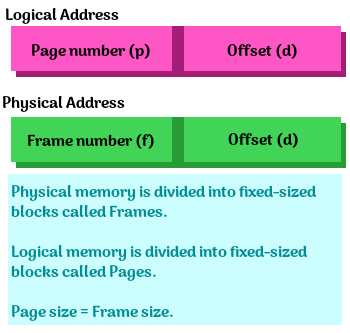
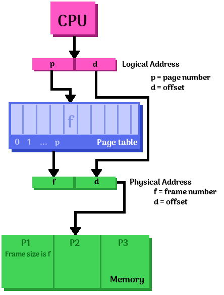

# Final Review

FML.

* [Go to my midterm analysis](#midterm-analysis)
* [Go to my final review stuff](#final-exam-review)
* [Go to my final exam postmortem](#final-exam-postmortem)

---

# Midterm analysis

I got a 78% on the Midterm, partially because I did not study from the
*right* resources. The lesson I learned from the midterm was:

*Don't study by reading the textbook.*

This time around, I'm going to primarily study off the instructor's
slides and the Blackboard quizzes, as a lot of the application problems
came from the quizzes that we only ever covered in *that form* on
the quizzes.

I have my Midterm exam paper, and I can now compare it to the instructor's
Midterm review slides as well, and figure out how closely it was an actual guide
to the exam.

### Midterm review guide vs. Midterm exam

* OS Structure
	* User Mode vs. Kernel Mode
	* System call
	* Monolithic Kernel vs. Micro Kernel
	* Diagram of *API - System Call - Operating System* together
	* UNIX: Monolithic Kernel - *on exam*
		* Pros and cons

* Processes
	* Address space layout
	* Process states - *on exam*
	* Other...
		* PCB
		* Context switch
		* Zombies, orphans
		* Communication overhead, processes & threads
	* Process state diagram - *on exam*
	* Process address space - *on exam*
		* Text, data, heap, stack - *on exam*

* Inter-process communication
	* Shared memory vs. message passing pros/cons - *on exam*

* Threads
	* User threads vs. Kernel threads
	* Benefits?
	* Diagram of single-threaded and multi-threaded processes - *on exam*

* Synchronization
	* Race conditions
	* Synchronization instructions
	* Spinlock
	* Mutex
	* Race condition
	* Bounded buffer problem
	* Deadlocks - *on exam*
		* Conditions
		* Resource allocation graph
		* Banker's algorithm
		* Dining philosophers
	* Starvation

* Scheduling
	* FCFS, SJF,RR - *on exam*
	* Gantt charts - *on exam*
	* Fair scheduling
	* Fixed priority scheduling
	* Multi-level scheduling
	* Load balancing, multicore scheduling
	* Round-Robin Gantt chart, waiting time, schedule latency - *on exam*
	* Pros and Cons - *on exam*

**Types of application problems:**

* Given code that forks a process and runs an exec command, what is the output?
	* Slides had different example without exec; lack of time and not paying attention caused me to get this one partially wrong.
* Spinlock code / Test-and-set with fill-in-the-blank parts to complete it.
	* *On the slides*
* Multithreaded program without locks, possible outcomes.
	* Kind of on slides
* Implementing a monitor and a sempahore for bounded-buffer problem.
	* Subjective question of "Which version is easier to understand?" that I apparently got 1 point off on???
	* Examples were in the slides
* Given tables of processes and resources, figure out if there is a deadlock.
	* *Example on slides*
* Given a table of processes and arrival/burst times, draw Gantt diagrams and calculate averages.
	* *Example on slides*

**Other things not necessarily on the slides:**

* Multiprogramming
* Time sharing
* Dual mode hardware mechanism
* "who" manages the CPU cache?
* What hardware support is required to implement a preemptive CPU scheduler?
* Where CPU register values are stored
* Where global variables are stored
* Anonymous piping
* User-level threading
* Protection of multi-threaded architecture vs. multi-process architecture

---

# Final Exam review

	Topics: 	* Virtual Memory			* Paging			* MMU / TLB
				* Address Translation		* Demand Paging		* Page Replacement & Swapping
				* I/O Devices				* Disk				*  I/O Mechanisms
				* Filesystem				* Name resolution	* Storage caches
				* Network					* Security & Virtual Machine


## Virtual Memory

How the operating system makes it appear that there's more memory
than there actually is, so that each process thinks it has more memory than
is available.


## Paging

The OS creates the page table and the hardware reads the page table.

Advantages are that there is no external fragmentation; there is
efficient use of memory. Internal fragmentation, however, may still exist.

**Operating system support:**

* The OS manages the MMU, and sometimes the TLB.
* The OS determines the address mapping

> In computing, virtual memory is a memory management technique that is implemented using both hardware and software. It maps memory addresses used by a program, called virtual addresses, into physical addresses in computer memory. Main storage as seen by a process or task appears as a contiguous address space or collection of contiguous segments. The operating system manages virtual address spaces and the assignment of real memory to virtual memory.
[Wikipedia](https://en.wikipedia.org/wiki/Virtual_memory)

**Paging issues:**

* Too big: Waste space, small table size
* Too small: Large table size, wasted space minimization
* Typical size: 4 KB

**Alternatives:**

* Many real-time operating systems don't have virtual memory.


## Types of MMUs

> A memory management unit (MMU), sometimes called paged memory management unit (PMMU), is a computer hardware unit having all memory references passed through itself, primarily performing the translation of virtual memory addresses to physical addresses. It is usually implemented as part of the central processing unit (CPU), but it also can be in the form of a separate integrated circuit.

> An MMU effectively performs virtual memory management, handling at the same time memory protection, cache control, bus arbitration and, in simpler computer architectures (especially 8-bit systems), bank switching.
[Wikipedia](https://en.wikipedia.org/wiki/Memory_management_unit)


### Segmentation MMU (base+limit)


**Simple MMU**, with some *BaseAddr*, we get the *PAddr* with *PAddr = VAddr + BaseAddr*.

This would be fast, but has no protection and it is wasteful.

The routine is only loaded as-needed, and not when it is not.


**Better MMU**:

* If *VAddr > limit*:
	* Trap and report error
* Else:
	* *PAddr = VAddr + BaseAddr*

 *I also hereby declare this diagram public domain as well.*

This adds error detection, and we can trap an error.

This also supports variable-sized partitions.

However, it can lead to fragmentation.


### Paging MMUs (page tables)

* Physical memory is divided into fixed-sized blocks, which are called **frames**.
* Logical memory blocks are divided into fixed-sized blocks, which are called **pages**.
* page size = frame size
* A **page table** maps the pages onto frames.

		p: page number		d: page offset (BECAUSE THAT HAS A "d" ANYWHERE IN THE NAME...)

These addresses look like:



And the diagram for this MMU scheme:



And mapping looks like this:


## Translation lookaside buffer

> A Translation lookaside buffer (TLB) is a memory cache that is used to reduce 
the time taken to access a user memory location.
[Wikipedia](https://en.wikipedia.org/wiki/Translation_lookaside_buffer)


### Two-level paging


## Fragmentation

> In computer storage, fragmentation is a phenomenon in which storage space is used inefficiently, reducing capacity or performance and often both
[Wikipedia](https://en.wikipedia.org/wiki/Fragmentation_(computing))


### Internal fragmentation:

> Due to the rules governing memory allocation, more computer memory is sometimes allocated than is needed. For example, memory can only be provided to programs in chunks divisible by 4, 8 or 16, and as a result if a program requests perhaps 23 bytes, it will actually get a chunk of 32 bytes. When this happens, the excess memory goes to waste. In this scenario, the unusable memory is contained within an allocated region. This arrangement, termed fixed partitions, suffers from inefficient memory use - any process, no matter how small, occupies an entire partition. This waste is called internal fragmentation.

> Unlike other types of fragmentation, internal fragmentation is difficult to reclaim; usually the best way to remove it is with a design change. For example, in dynamic memory allocation, memory pools drastically cut internal fragmentation by spreading the space overhead over a larger number of objects.
[Wikipedia](https://en.wikipedia.org/wiki/Fragmentation_(computing)#Internal_fragmentation)


### External fragmentation:

> External fragmentation arises when free memory is separated into small blocks and is interspersed by allocated memory. It is a weakness of certain storage allocation algorithms, when they fail to order memory used by programs efficiently. The result is that, although free storage is available, it is effectively unusable because it is divided into pieces that are too small individually to satisfy the demands of the application. The term "external" refers to the fact that the unusable storage is outside the allocated regions.

> For example, consider a situation wherein a program allocates 3 continuous blocks of memory and then frees the middle block. The memory allocator can use this free block of memory for future allocations. However, it cannot use this block if the memory to be allocated is larger in size than this free block.
[Wikipedia](https://en.wikipedia.org/wiki/Fragmentation_(computing)#External_fragmentation)


## Application: Calculate page table size

**How many pages are needed for 4 GB (of physical memory...?) @ 32 bit?**

4 GB / 4 KB = 1 Million Pages

**What is the required page table size?**

1 Page table entry is 4 bytes...

1 Million * 4 bytes = 4 MB


## Application: Virtual Address Translation

Translating a virtual address to a physical address...

Given a virtual address ```0x12345678```, or:

<table>
<tr><th colspan="2">Virtual Address</th></tr>
<tr><th>p</th><th>d</th></tr>
<tr><td>0x12345</td><td>0x678</td></tr>
</table>

The *p* portion goes to the *page table* at location ```0x12345```:

<table>
<tr><th colspan="2">Page Table</th></tr>
<tr><th>0x00000</th><td>...</td></tr>
<tr><th>...</th><td>...</td></tr>
<tr><th>0x12345<th>Frame #: 0xabcde</td></tr>
<tr><th>...</th><td>...</td></tr>
</table>

We use the same *offset (d)* from the virtual address to the physical address,
and we use the *frame # (f)* given from the page table.

<table>
<tr><th colspan="2">Physical Address</th></tr>
<tr><th>f</th><th>d</th></tr>
<tr><td>0xabcde</td><td>0x678</td></tr>
</table>


## Application: Virtual Address Translation pt 2

We have a virtual address...

<table>
<tr><th colspan="3">Virtual Address</th></tr>
<tr>
<td>1st Level p<sub>1</sub></td>
<td>2nd Level p<sub>2</sub></td>
<td>Offset d</td></tr>
</table>

The *base ptr* points to the beginning of the **1st level page table**,
and we use *p<sub>1</sub>* to get a position, which maps to
one specific 2nd level page table.

In the **2nd level page table**, we begin at the beginning of this
table as well. *p<sub>2</sub>* is used to get a position,
and this maps to the *frame # (f)*.

The physical address' offset *d* is brought over from the logical address.


## Application: How to calculate bits for page offset

We have a logical address with a page size of *x* KB.
In this logical address, how many bits are used to represent the page offset?

**Given:**

* *x*: Page size of logical address, in KB

**Calculate:**

The offset field must contain *y* bits...

2<sup>y</sup> = x


## Application: How to calculate entries in page table

How many entries are in a page table if we are using *x* bits
of a virtual address as the index bits?

**Given:**

* *x*: size of the index bits for a virtual address

**Calculate:**

The amount of entries *y* in the page table...

y = 2<sup>x</sup>


## Application: How to calculate page number given address and page size

Given some logical address *a*<sub>(16)</sub> (hexadecimal #)
and a page size of *p* bytes, what is the page number?

**Given:**

* *a*: hexadecimal address
* *p*: page size


The page size is *p* bytes. In bits *b*, it would be

p = 2<sup>b</sup>

or

b = log<sub>2</sub>( p )

Remember that the logical address layout is like:

<table>
<tr>
<td colspan="2">Page</td>
<td>Offset</td>
</tr>
<tr>
<td>p<sub>1</sub></td>
<td>p<sub>2</sub></td>
<td>d</td>
</tr>
</table>

Each digit in a hexadecimal number corresponds to 4 bits

<table>
<tr>
<th>Hex</th>
<td>A</td>
<td>F</td>
</tr>
<tr>
<th>Binary</th>
<td>1010</td>
<td>1111</td>
</tr>
<tr>
<th>Decimal</th>
<td>10</td>
<td>15</td>
</tr>
</table>

So given the amount of bits *b*, you would take the first *b*
bits from the address. If *b* were 8, then...

<table>
<tr>
<th>
Address (Hex)
</th>
<td>
F
</td>
<td>
F
</td>
<td>
F
</td>
<td>
F
</td>
</tr>

<tr>
<th>
Address (Binary)
</th>
<td>
1111
</td>
<td>
1111
</td>
<td>
1111
</td>
<td>
1111
</td>
</tr>
<tr>
<td></td>
<td colspan="2">
First 8
</td>
<td colspan="2">
</td>
</tr>
</table>


## Application: How to calculate bits in second-level page table

For a two-level paging system with a *p* KB page size,
we have a 32-bit address. The outer page (1st level) has
*p<sub>1</sub>* entries. How many bits are used to represent the
second-level page table?

**Given:**

* *p*: Page size, in KB
* *p<sub>1</sub>*: Amount of entries in the 1st level page table
* *32*-bit address

Address layout again:

<table>
<tr>
<td colspan="2">Page</td>
<td>Offset</td>
</tr>
<tr>
<td>p<sub>1</sub></td>
<td>p<sub>2</sub></td>
<td>d</td>
</tr>
</table>

* How many bits are needed to represent p<sub>1</sub>?
	* p<sub>1</sub> = 2<sup>x</sup>
	* *x*: amount of bits needed to represent p<sub>1</sub>.

* Page offset needs to be able to index *p* bytes
	* p = 2<sup>y</sup>
	* *y*: bits needed for page offset

So we have bits for p<sub>1</sub> and offset *d*, but need to find p<sub>2</sub>.
Our address is 32 bits, so...

p<sub>2</sub> = 32 - p<sub>1</sub> - d


---

# Final Exam postmortem
