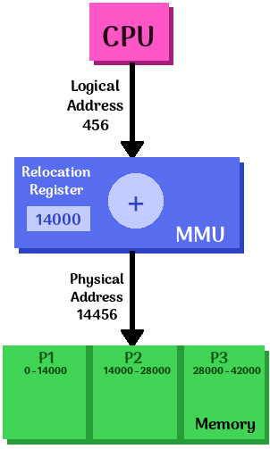

# Chapter 8: Main Memory, and Chapter 9: Virtual Memory

(The teacher merged these two chapters into one slide set).

Rachel's summary notes

* [Official book slides - Chapter 8](http://codex.cs.yale.edu/avi/os-book/OS9/slide-dir/PPT-dir/ch8.ppt)
* [Official book slides - Chapter 9](http://codex.cs.yale.edu/avi/os-book/OS9/slide-dir/PPT-dir/ch9.ppt)

---

# Slide notes

These are the topics covered in the slides, but finding those topics
covered elseware on the internet, such as Wikipedia.

## Goals

Virtual memory allows us to isolate processes, so that they do not
corrupt each other. It achieves this by abstracting memory out to
virtual memory, and all processes share the same virtual memory space.
This also helps us utilize our limited physical memory more efficiently.

> The primary benefits of virtual memory include freeing applications from having to manage a shared memory space, increased security due to memory isolation, and being able to conceptually use more memory than might be physically available, using the technique of paging.
[Wikipedia](https://en.wikipedia.org/wiki/Virtual_memory)

## Concepts to learn

* Virtual address translation
* Paging and TLB
* Page table management
* Swap

## Virtual memory VM

> In computing, virtual memory is a memory management technique that is implemented using both hardware and software. It maps memory addresses used by a program, called virtual addresses, into physical addresses in computer memory. Main storage as seen by a process or task appears as a contiguous address space or collection of contiguous segments. The operating system manages virtual address spaces and the assignment of real memory to virtual memory.
[Wikipedia](https://en.wikipedia.org/wiki/Virtual_memory)

**Hardware support:**

>  Address translation hardware in the CPU, often referred to as a **memory management unit or MMU**, automatically translates virtual addresses to physical addresses.
[Wikipedia](https://en.wikipedia.org/wiki/Virtual_memory)

> A **Translation lookaside buffer (TLB)** is a memory cache that is used to reduce the time taken to access a user memory location.[1][2] It is a part of the chip’s memory-management unit (MMU). The TLB stores the recent translations of virtual memory to physical memory and can be called an address-translation cache.
[Wikipedia](https://en.wikipedia.org/wiki/Translation_lookaside_buffer)

**Operating system support:**

* The OS manages the MMU, and sometimes the TLB.
* The OS determines the address mapping

**Alternatives:**

* Many real-time operating systems don't have virtual memory.


*By Ehamberg - Own work, CC BY-SA 3.0, https://commons.wikimedia.org/w/index.php?curid=8352077*

## MMU

> A memory management unit (MMU), sometimes called paged memory management unit (PMMU), is a computer hardware unit having all memory references passed through itself, primarily performing the translation of virtual memory addresses to physical addresses. It is usually implemented as part of the central processing unit (CPU), but it also can be in the form of a separate integrated circuit.

> An MMU effectively performs virtual memory management, handling at the same time memory protection, cache control, bus arbitration and, in simpler computer architectures (especially 8-bit systems), bank switching.
[Wikipedia](https://en.wikipedia.org/wiki/Memory_management_unit)


*By Mdjango, Andrew S. Tanenbaum - Own work, CC BY-SA 3.0, https://commons.wikimedia.org/w/index.php?curid=20478405*

## MMU Implementations

### Simple - Dynamic relocation using a relocation register

The textbook and the slides have this thing, but I can't find any references
to this type of structure on the internet, aside from *other* Operating Systems
classes that use the same textbook, so I'm guessing that this is just a 
theoretical example.

Here is my public domain version of the diagram that everybody uses:



**Simple MMU**, with some *BaseAddr*, we get the *PAddr* with *PAddr = VAddr + BaseAddr*.

This would be fast, but has no protection and it is wasteful.

The routine is only loaded as-needed, and not when it is not.

### Better - Hardware support for relocation and limit registers

**Better MMU**:

* If *VAddr > limit*:
	* Trap and report error
* Else:
	* *PAddr = VAddr + BaseAddr*

 *I also hereby declare this diagram public domain as well.*

This adds error detection, and we can trap an error.

This also supports variable-sized partitions.

However, it can lead to fragmentation.


### Modern - Now with paging™!

**(Not really trademarked)**

* Physical memory is divided into fixed-sized blocks, which are called **frames**.
* Logical memory blocks are divided into fixed-sized blocks, which are called **pages**.
* page size = frame size
* A **page table** maps the pages onto frames.

		p: page number		d: page offset (BECAUSE THAT HAS A "d" ANYWHERE IN THE NAME...)

These addresses look like:

 *more fine public domain work by RJM*


And the diagram for this MMU scheme:

 *CC-0*

And mapping looks like this:

 *CC-0*


## Virtual Address Translation

Translating a virtual address to a physical address...

Given a virtual address ```0x12345678```, or:

<table>
<tr><th>p</th><th>d</th></tr>
<tr><td>0x12345</td><td>0x678</td></tr>
</table>

The *p* portion goes to the *page table* at location ```0x12345```:

<table>
<tr><th>0x00000</th><td>...</td></tr>
<tr><th>...</th><td>...</td></tr>
<tr><th>0x12345<th>Frame #: 0xabcde</td></tr>
<tr><th>...</th><td>...</td></tr>
<tr><th>...</th><td>...</td></tr>
</table>

We use the same *offset (d)* from the virtual address to the physical address,
and we use the *frame # (f)* given from the page table.

<table>
<tr><th>f</th><th>d</th></tr>
<tr><td>0xabcde</td><td>0x678</td></tr>
</table>

## Paging

Advantages are that there is no external fragmentation; there is
efficient use of memory.

Internal fragmentation, however, may still exist.

Each load and store instruction requires accessing the page table
to translate the address. The table is stored in meomry, and memory
is slow to access.

Therefore, we can use the TLB...

## Translation Lookaside Buffer TLB

> A Translation lookaside buffer (TLB) is a memory cache that is used to reduce the time taken to access a user memory location.
[Wikipedia](https://en.wikipedia.org/wiki/Translation_lookaside_buffer)

## Multi-level paging

## Two level address translation

## Demand paging

## Page Table Entry PTE

## Partial memory mapping

## Page fault

## Anonymous page


## Fragmentation

> In computer storage, fragmentation is a phenomenon in which storage space is used inefficiently, reducing capacity or performance and often both
[Wikipedia](https://en.wikipedia.org/wiki/Fragmentation_(computing))

**Internal fragmentation:**

> Due to the rules governing memory allocation, more computer memory is sometimes allocated than is needed. For example, memory can only be provided to programs in chunks divisible by 4, 8 or 16, and as a result if a program requests perhaps 23 bytes, it will actually get a chunk of 32 bytes. When this happens, the excess memory goes to waste. In this scenario, the unusable memory is contained within an allocated region. This arrangement, termed fixed partitions, suffers from inefficient memory use - any process, no matter how small, occupies an entire partition. This waste is called internal fragmentation.

> Unlike other types of fragmentation, internal fragmentation is difficult to reclaim; usually the best way to remove it is with a design change. For example, in dynamic memory allocation, memory pools drastically cut internal fragmentation by spreading the space overhead over a larger number of objects.
[Wikipedia](https://en.wikipedia.org/wiki/Fragmentation_(computing)#Internal_fragmentation)

**External fragmentation:**

> External fragmentation arises when free memory is separated into small blocks and is interspersed by allocated memory. It is a weakness of certain storage allocation algorithms, when they fail to order memory used by programs efficiently. The result is that, although free storage is available, it is effectively unusable because it is divided into pieces that are too small individually to satisfy the demands of the application. The term "external" refers to the fact that the unusable storage is outside the allocated regions.

> For example, consider a situation wherein a program allocates 3 continuous blocks of memory and then frees the middle block. The memory allocator can use this free block of memory for future allocations. However, it cannot use this block if the memory to be allocated is larger in size than this free block.
[Wikipedia](https://en.wikipedia.org/wiki/Fragmentation_(computing)#External_fragmentation)

---

# Application questions

## How to calculate bits for page offset

We have a logical address with a page size of *x* KB.
In this logical address, how many bits are used to represent the page offset?

**Given:**

* *x*: Page size of logical address, in KB

**Calculate:**

The offset field must contain *y* bits...

2<sup>y</sup> = x


## How to calculate entries in page table

How many entries are in a page table if we are using *x* bits
of a virtual address as the index bits?

**Given:**

* *x*: size of the index bits for a virtual address

**Calculate:**

The amount of entries *y* in the page table...

y = 2<sup>x</sup>


## How to calculate page number given address and page size

Given some logical address *a*<sub>(16)</sub> (hexadecimal #)
and a page size of *p* bytes, what is the page number?

**Given:**

* *a*: hexadecimal address
* *p*: page size


The page size is *p* bytes. In bits *b*, it would be

p = 2<sup>b</sup>

or

b = log<sub>2</sub>( p )

Remember that the logical address layout is like:

<table>
<tr>
<td colspan="2">Page</td>
<td>Offset</td>
</tr>
<tr>
<td>p<sub>1</sub></td>
<td>p<sub>2</sub></td>
<td>d</td>
</tr>
</table>

Each digit in a hexadecimal number corresponds to 4 bits

<table>
<tr>
<th>Hex</th>
<td>A</td>
<td>F</td>
</tr>
<tr>
<th>Binary</th>
<td>1010</td>
<td>1111</td>
</tr>
<tr>
<th>Decimal</th>
<td>10</td>
<td>15</td>
</tr>
</table>

So given the amount of bits *b*, you would take the first *b*
bits from the address. If *b* were 8, then...

<table>
<tr>
<th>
Address (Hex)
</th>
<td>
F
</td>
<td>
F
</td>
<td>
F
</td>
<td>
F
</td>
</tr>

<tr>
<th>
Address (Binary)
</th>
<td>
1111
</td>
<td>
1111
</td>
<td>
1111
</td>
<td>
1111
</td>
</tr>
<tr>
<td></td>
<td colspan="2">
First 8
</td>
<td colspan="2">
</td>
</tr>
</table>


## How to calculate bits in second-level page table

For a two-level paging system with a *p* KB page size,
we have a 32-bit address. The outer page (1st level) has
*p<sub>1</sub>* entries. How many bits are used to represent the
second-level page table?

**Given:**

* *p*: Page size, in KB
* *p<sub>1</sub>*: Amount of entries in the 1st level page table
* *32*-bit address

Address layout again:

<table>
<tr>
<td colspan="2">Page</td>
<td>Offset</td>
</tr>
<tr>
<td>p<sub>1</sub></td>
<td>p<sub>2</sub></td>
<td>d</td>
</tr>
</table>

* How many bits are needed to represent p<sub>1</sub>?
	* p<sub>1</sub> = 2<sup>x</sup>
	* *x*: amount of bits needed to represent p<sub>1</sub>.

* Page offset needs to be able to index *p* bytes
	* p = 2<sup>y</sup>
	* *y*: bits needed for page offset

So we have bits for p<sub>1</sub> and offset *d*, but need to find p<sub>2</sub>.
Our address is 32 bits, so...

p<sub>2</sub> = 32 - p<sub>1</sub> - d

---

# Chapter 8 Textbook Reading Notes

Only the processor can directly access main memory and registers (which are part of the processor).

## Basic hardware information

* we care about efficiency, speed, and correctness
* we need to care about protection
* processes will need their own individual memory spaces

[registers](https://en.wikipedia.org/wiki/Processor_register)

* contained within the processor
* processor can access registers directly
* fast access - usually within one clock cycle

[Main memory](https://en.wikipedia.org/wiki/Computer_data_storage#Primary_storage)

* aka RAM
* processor can also access main memory directly
* data must be moved into memory in order for CPU to work with it
* main memory cannot be accessed by the CPU as quickly as registers can
* if the processor has to wait for memory access, then the processor
will **stall** since it is waiting on info that it needs to process.
	* need to design around this to make sure CPU usage is efficient
	* cache is a solution
	
[Cache](https://en.wikipedia.org/wiki/CPU_cache)

* a cache is used "in-between" the CPU and the main memory.

### Splitting up memory between processes

* Split up memory so that each process has its own memory space
* **base register** - smallest physical memory address
* **limit register** - size of the range
* base and limit registers are used to protect operating-system memory,
and can only be loaded by the OS.
* The OS has access to all memory though, including process memory.
	* allows the OS to load programs into the user memory
	* can also dump out programs if there is an error
	* provide other services
		* I/O
		* system calls
* A process accessing memory outside of its designated space results in a fatal error.

### Address binding

* binary files (programs) have to be loaded from the disk to memory,
and given to a process.
* processes are in the input queue as they wait to be part of memory.
* a process is taken from the input queue and loaded into memory.
* instructions & data are accessed from memory.
* In a program, addresses used are symbolic. The compiler will bind
those *symbolic addresses* to *relocatable addresses*.
* Binding can occur at various times:
	* Compile time - we can generate **absolute code** for processes that
	will be at a certain place in memory, and we know this place at 
	compile time. (e.g., MS DOS)
	* Load time - **relocatable code** is generated, and binding is
	done at load time if we don't know where the process will be in memory.
	* Execution time - binding will be done at runtime if a process can
	move from one memory segment to another. Special hardware is needed
	for this.

### Logical vs. physical address space

* **logical address** - address generated by the CPU
* **physical address** - address seen by the memory unit & loaded into memory-address register

* identical logical & physical addresses - compile-time and load-time binding
* different logical & physical addresses - load-time binding
	* logical address is called the **virtual address**.

* **logical address space** - set of all the generated logical addresses.
* **physical address space** - set of all physical addresses

* **memory-management unit (MMU)** - handles the mapping from virtual to physical addresses,
done at run time. This is a hardware dvice.
* **relocation register** - the base register

### dynamic loading

* a routine is only loaded once it is called
* routines are stored on disk

### dynamic and shared libraries

* **Dynamically linked libraries** - linked to binary when the binary is run
* **Static linking** - everything built into the binary

## Swapping

* A process can be swapped out of memory
* Processes that have been swapped are in a **backing store**
* Can be brought back to memory to continue execution
* This allows processes to utilize more (total) memory than what actually exists

### Standard swapping

* **ready queue** - all processes sitting on the backing store,
or in memory andready.
* context-switch time is high

### Swapping on mobile systems

* mobile devices usually don't support swapping.
* Android use flash memory to store application state when a process is terminated
in case user wants to restore it but it was killed to regain processing resources.

## Contiguous memory allocation

Page 360 - 361

		enig-atendovico = input queue
		parto = partition
		koneksa = contiguous
		memoro = memory
		procezo = process
		skemo = scheme
		operaciumo = operating system
		tabelo = table

* Need to be efficient, yo.
* Memoro estas dividita al du partoj (partitions)
	* Unu: por la operaciumo
	* Du: La uzantaj procezoj
* La operaciumo povas esti aŭ malalta memoro (low memory) aŭ alta memoro (high memory).
* Ni volas havi multajn uzantprocezojn enmemore samtempe.
Pro tio, ni devas desegni metodon por asigni uzeblan memoron al la procezoj
kiuj estas en la enig-atendovico (input-queue).
* Ni uzas **koneksan-memoron-asignon** (contiguous memory allocation) por
enhavi ĉiun procezon en sola bloko de memoro. La bloko estas koneksa (contiguous)
al la bloko, kiu enhavas la sekvontan procezon.

### Memory protection

Page 361

* Por protekti la memoron, ni bezonas uzi duan metodon:
	* Ni havas translokig-reĝistron (relocation-register).
	Ĝi havas la plej malgrandan fizikan adreson (smallest physical address).
	* Ni havas lim-reĝistron (limit-register).
	Ĝi havas la intervalon de la logikaj adresoj (range of the logical addresses).
	* Ĉiu logika adreso devas esti inter la intervalo.
	* La MMU mapigas la logikan adreson dinamike; ĝi aldonas la valoron en la
	translokig-reĝistro. La mapigita adreso estas sendas al memoro.

### Memory allocation

Page 362

* simpla metodo (simple method) - Creating partitions that store one proecss each
	* Kiam parto estas sen-procezo, unu de la procezoj estas selektita el
	la *enig-atendovico* kaj donita al la libera parto.
	* Neniu ankoraŭ uzas tiun metodon.
* variabla-parto skemo (variable-parition scheme) - 
	* la operaciumo havas tabelon, kiu specifas ke kiuj partoj de la memoro estas
	uzebla, kaj kiuj estas okupitaj.
	* Unue, ĉiom de la memoro estas uzeblaj, kaj estas unu granda bloko. (a hole)
	* Eventuale, memoro havos truojn de multaj grandecoj.
	* La uzeblaj blokoj de memoro estas signaro (set) de truoj.
	* Eble la sistemo bezonas malfragmentigi la memoron do estus sufiĉe da
	grand-truo por aldoni al procezo.

* Translokigo de memoro-blokoj:
	* dinamika-konservado-asigni-problemo (**dynamic storage-allocation problem**).
		* first-fit, best-fit, worst-fit...

* **first-fit** - Asigni la unua truo kiu estas sufiĉe granda.
	* Ni povas serĉi el la komenco de la truo-signaro, aŭ ĉe la loko, kie
	la pasinta first-fit serĉo finis.
	* Ni haltas kiam ni trovas la unuan uzeblan truon.
* **best-fit** - Asigni la plej malgranda truo kiu estas sufiĉe granda.
	* Ni bezonas serĉi la tutan liston (sed ne se la listo estas ordigita de grandeco.)
* **worst-fit** - Asigni la plej grand atruo. 
	* Ni bezonas serĉi la tutan liston (sed ne se la listo estas ordigita de grandeco.)
	* Ni havos la plej grandan "leftover" truon. Tiu eble estus plia utila ol
	malgrandaj truoj el la best-fit metodo.

### Fragmentation

Page 363

La "first-fit" kaj "best-fit" metodoj havas problemon: externa fragmentado.
(**external fragmentation**).

* internal fragmentation
* external fragmentation

* solution: compaction
* solution: permit noncontiguousness

## Segmentation

Page 364

* Segmentation is treating memory as if it is segments within the
logical address space, rather than viewing it as all contiguous memory
spaces.
* A segment has a name and length.
* La adreso specifas la nomo de la segment kaj la offset inter la segment.
* La programisto specifas segment-nomon kaj offset por ĉiu adreso.

* Logical address: <segment-number, offset>

### Hardware

* **segment table**
* **segment base**
* **segment limit**

* Ĉiu segmento de la segmentabelo havas segmentbazon kaj segmentlimon.

## Paging

* Segmentation is one kind of scheme, and paging is another.
* Paging also allows memory to be viewed as non-contiguous.
* Paging can avoid external fragmentation (segmentation doesn't).

### Basics

* Ni dividas la fizikan memoron al fiksgrandaj blokoj, kiuj estas nomiĝitaj "kadroj" (frames),
kaj ni dividas la logikan memoron al samgrandecaj blokoj, kiuj estas nomiĝitaj "paĝoj" (pages).

* Kiam procezo volas plenumi (execute), ĝiaj paĝoj estas ŝargata al
iuj uzeblaj memoro-kadroj (memory-frames).

* Ĉiu adreso havas du partojn: paĝnombron (Page number p), kaj paĝdeŝovon (Page offset d).

La page number estas la indekso al la paĝtabelo.

La bazadreso estas aldonas al la page offset, por akiri la fizikan memadreson, kaj
tiu ĉi estas sendita al la Memory Unit.

Page 369 has some diagrams of page offset stuff.

Also calculations.

Boring boring boring.

### Hardware

I'm going to read this shit tomorrow.

## Structure of the page table

Structure of a Page Table: Page 378, Chapter 8.6

---

# Chapter 8 Vocabulary

* basic hardware
	* stall
	* cache
	* base register
	* limit register
* address binding
	* input queue
	* binding
	* absolute code
	* relocatable code
* logical vs. physical address space
	* logical address
	* memory-address register
	* physical address
	* virtual address
	* logical address space
	* physical address space
	* memory management unit (MMU)
	* relocation register
* dynamic loading
* dynamic linking and shared libraries
	* dynamically linked libraries
	* static linking
	* stub
	* shared libraries
* swapping
	* backing store
	* standard swapping
		* ready queue
		* double buffering
	* swapping on mobile systems
		* application state
	* contiguous memory allocation
	* memory protection
		* transient
	* memory allocation
		* partitions
		* multiple-partition method
		* variable-partition
		* hole
		* dynamic storage-allocation problem
		* first-fit
		* best-fit
		* worst-fit
	* fragmentation
		* external fragmentation
		* 50-percent rule
		* internal fragmentation
		* compaction
* segmentation
	* basic method
	* segmentation hardware
		* segment table
		* segment base
		* segment limit
* paging
	* basic method
		* frames
		* pages
		* page number (p)
		* page offset (d)
		* page table
	* hardware support
		* registers
		* page-table base register (PTBR)
		* translation look-aside buffer (TLB)
		* TLB miss
		* wired down
		* address-space identifiers (ASIDs)
		* flushed
		* hit ratio
		* effective memory-access time
	* protection
		* valid-invalid bit
		* page-table length register (PTLR)
	* shared pages
		* reentrant code (pure code)
* structure of the page table
	* hierarchical paging
		* forward-mapped page table
		* Digital Equipment Corporation (DEC)
		* VAX minicomputer
	* hashed page tables
		* clustered page tables
		* sparse
	* inverted page tables
	* Oracle SPARC Solaris
		* Solaris
		* SPARC
		* TLB walk
* example:  Intel 32 and 64-bit architectures
	* IA-32 architecture
		* IA-32 segmentation
			* local descriptor table (LDT)
			* global descriptor table (GDT)
			* linear address
		* IA-32 paging
			* page directory
			* page address extension (PAE)
			* page directory pointer table
	* x86-64
		* Itanium
		* AMD64
		* Intel 64
* example: ARM architecture
	* sections
	* micro TLBs
	* main TLB

---


# Chapter 9 Vocabulary

* virtual memory
* virtual address space
* sparse
* demand paging
	* lazy swapper
	* pager
	* basis concepts
		* memory resident
		* page fault
		* pure demand paging
		* locality of reference
		* swap space
	* performance of demand paging
		* effective access time
		* page-fault rate
		* anonymous memory
* copy-on-write
	* pool
	* zero-fill-on-demand
	* virtual memory fork
* page replacement
	* over-allocating
	* page replacement
	* basic page replacement
		* victim frame
		* modify bit / dirty bit
		* frame-allocation algorithm
		* page-replacement algorithm
		* reference string
	* FIFO page replacement
		* Belady's anomaly
	* optimal page replacement
		* optimal page-replacement algorithm
	* LRU page replacement
		* least recently used (LRU) algorithm
	* stack algorithms
	* LRU-approximation page replacement
		* reference bit
		* additional-reference-bits algorithm
			* second-chance page-replacement algorithm
		* second-chance algorithm
			* clock
		* enhanced second-chance algorithm
	* counting-based page replacement
		* least frequently used (LFU)
		* most frequently used (MFU)
	* page-buffering algorithms
	* applications and page replacement
		* raw disk
* allocation of frames
	* minimum number of frames
	* allocation algorithms
		* equal allocation
		* proportional allocation
	* global vs. local allocation
		* global replacement
		* local replacement
	* non-uniform memory access (NUMA)
* thrashing
	* cause of thrashing
		* local replacement algorithm / priority replacement algorithm
		* locality model
	* working-set model
		* working-set window
		* working set
	* page-fault frequency (PFF)
* memory-mapped files
	* basic mechanism
	* shared memory in the Windows API
		* file mapping
		* view
		* named shared-memory object
	* memory-mapped I/O
		* port
		* programmed I/O (PIO)
		* interrupt driven
* allocating kernel memory
	* buddy system
		* power-of-2 allocator
		* buddies
		* coalescing
	* slab allocation
		* slab
		* cache
		* objects
* other considerations
	* prepaging
	* page size
		* resolution
	* TLB reach
		* hit ratio
	* inverted page tables
	* program structure
	* I/O interlock and page locking
		* pinning
* operating-system examples
	* Windows
		* clustering
		* working-set minimum
		* working-set maximum
		* automatic working-set trimming
	* Solaris
		* pageout
		* priority paging

